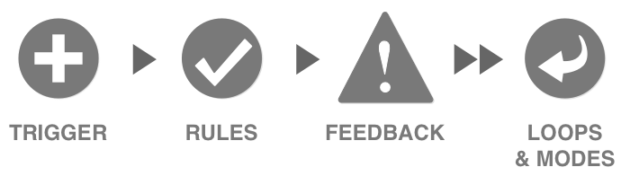

# Learn about behavioral programming

## What is behavioral programming?[^1]

Behavioral Programming, or bProgram for short, is based on scenarios. Behavioral
programs are composed of threads of behavior. These threads run in parallel to
coordinate a sequence of events via a synchronized protocol. During a bProgram's
execution, when a thread wants to synchronize with its peers, it submits a
statement to the central event arbiter using the sync statement. This statement
is returned when we invoke a bProgram. > A **sync** statement declares which
events the **thread** requests, which events it waits for (but does not
request), and which events it would like to block (that is, prevent from being
selected). Request, block and waitFor events can be described by passing a
RuleSet object to the sync statement as parameter.

```ts
export type RuleSet<
  T extends (Detail) = (Detail),
> = {
  waitFor?: ParameterIdiom<T> | ParameterIdiom<T>[];
  request?: RequestIdiom<T> | RequestIdiom<T>[];
  block?: ParameterIdiom<T> | ParameterIdiom<T>[];
};
```

After calling sync, the thread is blocked, waiting for the rest of the threads
to synchronize as well. When all threads have submitted their statements, the
arbiter selects an event that was requested but not blocked. It then wakes up
the threads that requested or waited for that event. The rest of the threads
remain blocked, until an event they requested or waited for is selected.

Behavioral Programming was introduced by Harel, Marron and Weiss in 2012 in a
[paper](../assets/behavioral-programming.pdf) published at the Communications of
the ACM.

To learn more watch
[Rethinking Software Systems: A friendly introduction to Behavioral Programming by Michael Bar Sinai, 2018](https://youtu.be/PW8VdWA0UcA)

## Why behavioral programming

### tldr;

- Since each thread can not only specify which event to wait for, which event to
  request and which event to block the state of the program becomes implicit.
- Any thread can block execution of other threads thus allowing us to
  effectively modifying program behavior by simply adding new threads that
  append to event log.
- This idiomatic approach to programming aligns perfectly with microinteractions

### Intuitions

1. UI is a function of data[^2]
2. Data is derived from an event log[^2]
3. Deciding when and what to append to the event log is the most complex part of
   development[^2]
4. Finding more natural ways for deciding when and what to append to the event
   log is the direction we should be moving towards[^2]

With Behavioral Programming we control the event log using behavioral threads.
The key idea of behavioral programming is that we can create new threads that
change the behavior of already written threads. Thanks to this idea, when our
software specification changes, we don’t necessarily need to modify existing
code. We can add new threads that modify the behavior of other threads. Each
thread lives on its own and is unaware of other threads, but they’re all
interwoven at runtime, allowing them to interact with each-other in a very
[novel way](#what-is-behavioral-programming1).

What's truly novel about this approach to application development is that we are
no longer managing state explicitly. It is an implicit byproduct of the
behavioral threads we create which control the event log. We can even create
snapshots of the state at every synchronization point of a bProgram run, to see
how our application state changes as events flow through our bProgram.

#### Scenario

We want to create an app that controls hot and cold water taps, whose output
flows are mixed.

```ts
import { expect, test } from "bun:test";
import { bProgram, DevCallback } from "@plaited/behavioral";

test("logging", () => {
  const logs: Parameters<DevCallback>[0][] = [];
  /**
   * Initiate our bProgram and destructure behavioral
   * programming utility functions
   */
  const {
    /** adds behavioral threads to behavioral program  **/
    addThreads,
    /**
     * creates a behavioral thread from synchronization sets and/or other
     * behavioral threads
     */
    thread,
    /**
     * A behavioral thread that loops infinitely or until some
     * callback returns false.This function returns a threads
     */
    loop,
    /**
     * At synchronization points, each behavioral thread
     * specifies three sets of events:
     * 1. requested events: the thread proposes that these be
     * considered for triggering
     * 2. waitFor events: the thread asks to be notified when
     * any of them is triggered
     * 3. blocked events: the threads currently forbids
     * triggering any of these events
     */
    sync,
    /** trigger the run of the behavioral program by requesting
     * the event passed as an argument
     */
    trigger,
    /** connect an action callback to the behavioral program that is
     * called when request event type of the same name as our
     * callback is selected by our behavioral program's
     * central event arbiter
     */
    feedback,
  } = bProgram({
    /**
     * Example of logging callback we can pass to our bProgram
     * options dev field.
     */
    dev: (msg) => logs.push(msg), // Logging callback
  });

  /** Add our rules for bProgram execution */
  addThreads({
    addHot: thread(
      sync({ request: { type: "hot" } }),
      sync({ request: { type: "hot" } }),
      sync({ request: { type: "hot" } }),
    ),
    addCold: thread(
      sync({ request: { type: "cold" } }),
      sync({ request: { type: "cold" } }),
      sync({ request: { type: "cold" } }),
    ),
    mixHotCold: loop([
      sync({
        waitFor: { type: "hot" },
        block: { type: "cold" },
      }),
      sync({
        waitFor: { type: "cold" },
        block: { type: "hot" },
      }),
    ]),
  });

  const actual: string[] = [];
  /** Add action callback to our feedback function */
  feedback({
    hot() {
      actual.push("hot");
    },
    cold() {
      actual.push("cold");
    },
  });
  trigger({ type: "start" });
  expect(actual).toEqual([
    "hot",
    "cold",
    "hot",
    "cold",
    "hot",
    "cold",
  ]);
  expect(logs).toMatchSnapshot();
});
```

The snapshot from the resulting test gives us insight into the behavior and
state of application temporally.

```js
const logs = [
  [
    {
      "priority": 0,
      "request": [
        {
          "detail": undefined,
          "type": "start",
        },
      ],
      "selected": "start",
      "thread": "start",
      "trigger": true,
      "waitFor": [
        {
          "cb": [Function],
          "type": "",
        },
      ],
    },
    {
      "priority": 1,
      "request": [
        {
          "type": "hot",
        },
      ],
      "thread": "addHot",
    },
    {
      "priority": 2,
      "request": [
        {
          "type": "cold",
        },
      ],
      "thread": "addCold",
    },
    {
      "block": [
        {
          "type": "cold",
        },
      ],
      "priority": 3,
      "thread": "mixHotCold",
      "waitFor": [
        {
          "type": "hot",
        },
      ],
    },
  ],
  [
    {
      "priority": 1,
      "request": [
        {
          "type": "hot",
        },
      ],
      "selected": "hot",
      "thread": "addHot",
    },
    {
      "priority": 2,
      "request": [
        {
          "type": "cold",
        },
      ],
      "thread": "addCold",
    },
    {
      "block": [
        {
          "type": "cold",
        },
      ],
      "priority": 3,
      "thread": "mixHotCold",
      "waitFor": [
        {
          "type": "hot",
        },
      ],
    },
  ],
  [
    {
      "priority": 1,
      "request": [
        {
          "type": "hot",
        },
      ],
      "thread": "addHot",
    },
    {
      "priority": 2,
      "request": [
        {
          "type": "cold",
        },
      ],
      "selected": "cold",
      "thread": "addCold",
    },
    {
      "block": [
        {
          "type": "hot",
        },
      ],
      "priority": 3,
      "thread": "mixHotCold",
      "waitFor": [
        {
          "type": "cold",
        },
      ],
    },
  ],
  [
    {
      "priority": 1,
      "request": [
        {
          "type": "hot",
        },
      ],
      "selected": "hot",
      "thread": "addHot",
    },
    {
      "priority": 2,
      "request": [
        {
          "type": "cold",
        },
      ],
      "thread": "addCold",
    },
    {
      "block": [
        {
          "type": "cold",
        },
      ],
      "priority": 3,
      "thread": "mixHotCold",
      "waitFor": [
        {
          "type": "hot",
        },
      ],
    },
  ],
  [
    {
      "priority": 1,
      "request": [
        {
          "type": "hot",
        },
      ],
      "thread": "addHot",
    },
    {
      "priority": 2,
      "request": [
        {
          "type": "cold",
        },
      ],
      "selected": "cold",
      "thread": "addCold",
    },
    {
      "block": [
        {
          "type": "hot",
        },
      ],
      "priority": 3,
      "thread": "mixHotCold",
      "waitFor": [
        {
          "type": "cold",
        },
      ],
    },
  ],
  [
    {
      "priority": 1,
      "request": [
        {
          "type": "hot",
        },
      ],
      "selected": "hot",
      "thread": "addHot",
    },
    {
      "priority": 2,
      "request": [
        {
          "type": "cold",
        },
      ],
      "thread": "addCold",
    },
    {
      "block": [
        {
          "type": "cold",
        },
      ],
      "priority": 3,
      "thread": "mixHotCold",
      "waitFor": [
        {
          "type": "hot",
        },
      ],
    },
  ],
  [
    {
      "priority": 2,
      "request": [
        {
          "type": "cold",
        },
      ],
      "selected": "cold",
      "thread": "addCold",
    },
    {
      "block": [
        {
          "type": "hot",
        },
      ],
      "priority": 3,
      "thread": "mixHotCold",
      "waitFor": [
        {
          "type": "cold",
        },
      ],
    },
  ],
];
```

### Microinteractions and behavioral programming go together, like peanut butter and jelly

Modern web application are often the result of
[component driven user interface practices](). If a web app interface component
is even remotely interactive it has one or more [microinteractions]().

Dan Saffer’s model of microinteractions is a design concept that focuses on the
small, often overlooked details in product design that significantly influence
user experience. These minute interactions, such as the sound a device makes
when turned on or the animation of a loading icon, are fundamental to creating a
seamless, intuitive user experience.



The model consists of four parts: trigger, rules, feedback, and loops & modes.
The trigger initiates the microinteraction, rules determine how it functions,
feedback that lets the user know what's happening, and loops & modes that govern
its larger behavior.

Saffer’s model emphasizes that well-designed microinteractions are engaging,
informative, and human-centered, often defining the overall feel and function of
a product.

Coincidentally this model align with behavioral programming well and
[@plaited/behavioral](https://www.npmjs.com/package/@plaited/behavioral) has
been designed specifically to work within this pattern.

#### 1. Trigger function

Our trigger function triggers an event on component.

#### 2. Thread function

Our thread function serves as mechanism for writing rules on how and if we
respond to an event on our component.

#### 3. Feedback function

Our feedback function is used to respond to requested events allowed by our
behavioral threads, the rules, and let component users know what's happening
with our interactive component.

#### 4. Loop function

The loop function is ideal for web interfaces where trigger feedback pairs can
be triggered often infinitely such as checking and unchecking a checkbox for
example.

```ts type Loop = (rules: RulesFunc<any>[], condition?: () =>
boolean) => RulesFunc<any>
```

As we can see in the type above the loop function takes an optional second
argument, a callback function that returns true or false. By passing a callback
function that gets the current mode of our component (i.e. checked or unchecked)
in enables us to control which rules we're applying at a larger level each time
our behavioral program is run.

---

[^1]: [What is Behavioral Programming?](https://bpjs.readthedocs.io/en/latest/BPjsTutorial/index.html)

[^2]: [On User Interface Development: appending to the event log](https://medium.com/@lmatteis/on-user-interface-development-appending-to-the-event-log-8d8ca966795d)
