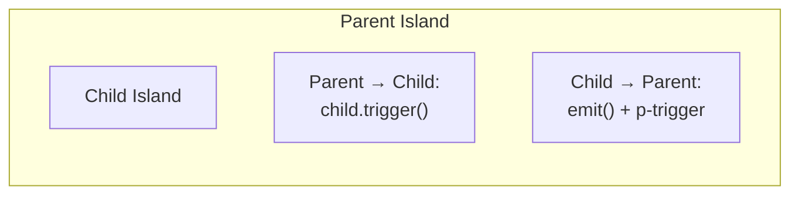
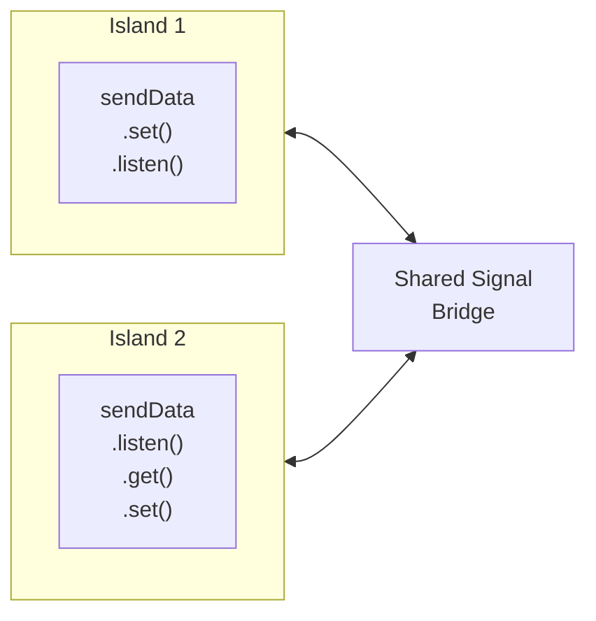

# Cross-Island Communication

Plaited provides three patterns for communication between interactive islands. Choose the pattern based on the relationship between components.

**For bElement basics**, see `b-element.md`
**For BP foundations**, see `behavioral-programs.md`
**For form integration**, see `form-associated-elements.md`

## Three Communication Patterns

### Pattern A: `trigger()` - Parent-to-Child (Direct)

Parent calls `trigger()` on child element in shadowDOM. This is **direct method invocation** on the child element.

```typescript
import { bElement } from 'plaited'

// Child element
const ChildElement = bElement({
  tag: 'child-element',
  publicEvents: ['processData'],  // Expose event for parent
  shadowDom: <div p-target="content"></div>,
  bProgram({ $ }) {
    return {
      processData({ data }) {
        const content = $('content')[0]
        content?.render(`Processed: ${data}`)
      }
    }
  }
})

// Parent element
const ParentElement = bElement({
  tag: 'parent-element',
  shadowDom: (
    <>
      <button p-target="btn" p-trigger={{ click: 'sendToChild' }}>Send</button>
      <ChildElement p-target="child" />
    </>
  ),
  bProgram({ $ }) {
    return {
      sendToChild() {
        // Direct trigger on child element
        const child = $('child')[0]
        child?.trigger({ type: 'processData', detail: { data: 'Hello!' } })
      }
    }
  }
})
```

**When to use**:
- Parent controls child behavior
- Direct hierarchical relationship
- Parent has reference to child in shadowDOM
- Synchronous communication

**Characteristics**:
- Type-safe via generics
- Direct method call pattern
- Child must expose event via `publicEvents`
- Only works for elements in shadowDOM

### Pattern B: `emit()` - Child-to-Parent (Bubbling)

Child broadcasts events up to parent using `emit()`. Parent listens via `p-trigger`.

```typescript
import { bElement } from 'plaited'

// Child element
const ChildElement = bElement({
  tag: 'child-element',
  shadowDom: (
    <button p-target="btn" p-trigger={{ click: 'save' }}>Save</button>
  ),
  bProgram({ emit }) {
    return {
      save() {
        // Emit event to parent
        emit({
          type: 'saveComplete',
          detail: { success: true, data: 'Saved data' },
          bubbles: true,      // Required for crossing boundaries
          composed: true      // Required for crossing shadow DOM
        })
      }
    }
  }
})

// Parent element
const ParentElement = bElement({
  tag: 'parent-element',
  shadowDom: (
    <ChildElement p-trigger={{ saveComplete: 'handleSave' }} />
  ),
  bProgram() {
    return {
      handleSave({ success, data }) {
        console.log('Child saved:', data)
      }
    }
  }
})
```

**When to use**:
- Child initiates communication
- Event bubbling pattern
- Child-to-parent notification
- Multiple parents might listen

**Characteristics**:
- DOM event system
- Crosses shadow boundaries with `bubbles: true, composed: true`
- Type-safe via generics
- Declarative via `p-trigger`

### Pattern C: `useSignal()` - Cross-Island (Pub/Sub) ⭐

Communication between islands **NOT in a parent-child relationship**. Uses actor pattern with multiple readers AND writers.

```typescript
import { bElement, useSignal } from 'plaited'

// Create shared signal
const sendData = useSignal<{ value: string }>()

// Island 1: Writer
const WriterIsland = bElement({
  tag: 'writer-island',
  publicEvents: ['send'],
  shadowDom: (
    <button p-target="btn" p-trigger={{ click: 'send' }}>Send Data</button>
  ),
  bProgram() {
    return {
      send() {
        // Write to signal
        sendData.set({ value: 'Hello from writer!' })
      }
    }
  }
})

// Island 2: Reader
const ReaderIsland = bElement({
  tag: 'reader-island',
  publicEvents: ['receive'],
  shadowDom: <div p-target="display"></div>,
  bProgram({ $, trigger }) {
    // Listen to signal changes
    sendData.listen('receive', trigger)

    return {
      receive({ value }) {
        const display = $('display')[0]
        display?.render(`Received: ${value}`)
      }
    }
  }
})

// Usage: Islands are siblings, not parent-child
<main>
  <WriterIsland />
  <ReaderIsland />
</main>
```

**When to use**:
- Islands NOT in direct parent-child relationship
- Cross-island coordination
- Shared state queries
- Multiple readers AND writers (actor pattern)

**Characteristics**:
- Pub/sub pattern
- Supports `.get()` for state queries
- Supports `.set()` for state updates
- Supports `.listen()` for subscriptions
- Automatic cleanup with PlaitedTrigger
- Actor pattern: bidirectional communication

## Decision Tree: When to Use Each Pattern

```
START: Need to communicate between elements?
│
├─ Are they in a PARENT-CHILD relationship?
│  │
│  ├─ YES: Is PARENT sending to CHILD?
│  │  └─ Use Pattern A: trigger()
│  │     - Parent calls child.trigger()
│  │     - Direct method invocation
│  │     - Child exposes via publicEvents
│  │
│  └─ YES: Is CHILD sending to PARENT?
│     └─ Use Pattern B: emit()
│        - Child uses emit()
│        - Parent listens via p-trigger
│        - Event bubbling pattern
│
└─ NO: Are they CROSS-ISLAND (not parent-child)?
   └─ Use Pattern C: useSignal()
      - Create shared signal
      - Islands .listen() and .set()
      - Pub/sub pattern
      - Actor model (bidirectional)
```

## Islands Architecture Context

Plaited encourages an **islands-based architecture** where interactive regions (islands) coordinate through behavioral programs.

### Normal Flow: Parent-Child

For direct hierarchical relationships:



### Cross-Island: useSignal

For islands NOT in direct hierarchy:



## Actor Pattern with Signals

Signals use the **actor pattern**: multiple readers AND writers can interact with shared state.

### Signal API

```typescript
const signal = useSignal<T>(initialValue?)

// Read current value
const current = signal.get()

// Write new value (notifies all listeners)
signal.set(newValue)

// Subscribe to changes
const disconnect = signal.listen(eventType, trigger, getLVC?)
// getLVC=true: Get Last Value on Connection (sends current value immediately)
```

### Bidirectional Communication

Multiple islands can both read AND write:

```typescript
import { bElement, useSignal } from 'plaited'

const sharedState = useSignal<{ count: number }>({ count: 0 })

// Island 1: Can read AND write
const Counter1 = bElement({
  tag: 'counter-one',
  publicEvents: ['increment', 'stateChange'],
  shadowDom: (
    <>
      <button p-trigger={{ click: 'increment' }}>+1</button>
      <span p-target="display"></span>
    </>
  ),
  bProgram({ $, trigger }) {
    // Listen for changes (from any island)
    sharedState.listen('stateChange', trigger, true)  // getLVC=true

    return {
      increment() {
        // READ current value
        const current = sharedState.get()
        // WRITE new value
        sharedState.set({ count: current.count + 1 })
      },

      stateChange({ count }) {
        const display = $('display')[0]
        display?.render(`Count: ${count}`)
      }
    }
  }
})

// Island 2: Can also read AND write
const Counter2 = bElement({
  tag: 'counter-two',
  publicEvents: ['increment', 'stateChange'],
  shadowDom: (
    <>
      <button p-trigger={{ click: 'increment' }}>+1</button>
      <span p-target="display"></span>
    </>
  ),
  bProgram({ $, trigger }) {
    sharedState.listen('stateChange', trigger, true)

    return {
      increment() {
        const current = sharedState.get()
        sharedState.set({ count: current.count + 1 })
      },

      stateChange({ count }) {
        const display = $('display')[0]
        display?.render(`Count: ${count}`)
      }
    }
  }
})

// Both islands update the same shared state
<Counter1 />
<Counter2 />
```

### State Queries via `.get()`

Signals support synchronous state queries:

```typescript
bProgram({ trigger }) {
  const userSettings = useSignal<{ theme: 'light' | 'dark' }>({ theme: 'light' })

  return {
    toggleTheme() {
      // Query current state
      const current = userSettings.get()

      // Update based on current state
      const newTheme = current.theme === 'light' ? 'dark' : 'light'
      userSettings.set({ theme: newTheme })
    }
  }
}
```

### Get Last Value on Connection (getLVC)

Subscribe with immediate value:

```typescript
bProgram({ trigger }) {
  // Get current value immediately, then listen for changes
  sharedSignal.listen('update', trigger, true)  // getLVC=true

  return {
    update(value) {
      // Receives current value immediately, then future updates
      console.log('Value:', value)
    }
  }
}
```

## useComputed for Derived State

Create derived signals from one or more source signals:

```typescript
import { useSignal, useComputed } from 'plaited'

// Source signals
const firstName = useSignal<string>('John')
const lastName = useSignal<string>('Doe')

// Computed signal (auto-updates when dependencies change)
const fullName = useComputed(
  () => `${firstName.get()} ${lastName.get()}`,
  [firstName, lastName]
)

// Usage in island
const NameDisplay = bElement({
  tag: 'name-display',
  publicEvents: ['nameChange'],
  shadowDom: <div p-target="display"></div>,
  bProgram({ $, trigger }) {
    // Listen to computed signal
    fullName.listen('nameChange', trigger, true)

    return {
      nameChange(name) {
        const display = $('display')[0]
        display?.render(`Full name: ${name}`)
      }
    }
  }
})

// When firstName or lastName changes, fullName auto-updates
firstName.set('Jane')  // NameDisplay updates to "Jane Doe"
lastName.set('Smith')  // NameDisplay updates to "Jane Smith"
```

**useComputed characteristics**:
- Lazy evaluation (only computed when accessed)
- Automatic dependency tracking
- Read-only (no `.set()` method)
- Subscribes to deps only when listeners exist
- Synchronous updates

## Signal Best Practices

### When NOT to Use Signals

Signals are powerful but have specific use cases. **Avoid signals for**:

#### ❌ One-Time Notifications

```typescript
// ❌ Don't use signal for one-time events
const saveSignal = useSignal()
saveSignal.set(undefined)  // Just a notification

// ✅ Use callback or promise instead
const handleSave = () => {
  saveToDatabaseAsync().then(() => {
    console.log('Saved')
  })
}
```

#### ❌ Single Listener Scenarios

```typescript
// ❌ Don't use signal if only one listener
const dataSignal = useSignal<Data>()

// Island A: only writer
dataSignal.set(data)

// Island B: only reader
dataSignal.listen('data', trigger)

// ✅ Use trigger/emit for direct parent-child
// OR event delegation if appropriate
```

#### ❌ Communication Following Component Tree

```typescript
// ❌ Don't use signal for parent-child
const parentToChildSignal = useSignal()

// ✅ Use trigger() for parent-to-child
child.trigger({ type: 'event', detail: data })

// ✅ Use emit() for child-to-parent
emit({ type: 'event', detail: data, bubbles: true, composed: true })
```

### When TO Use Signals

✅ **Cross-island shared state**:
```typescript
const cart = useSignal<CartItem[]>([])

// Multiple islands read/write cart
<CartList />      {/* Displays cart items */}
<AddToCart />     {/* Adds items */}
<Checkout />      {/* Reads total */}
```

✅ **Actor pattern (multiple readers/writers)**:
```typescript
const appState = useSignal<AppState>({})

// Many islands coordinate
<Sidebar />
<MainContent />
<Header />
<Footer />
```

✅ **Shared state queries**:
```typescript
const userPrefs = useSignal<UserPrefs>({ theme: 'light' })

// Any island can query current state
const currentTheme = userPrefs.get()
```

### Performance Considerations

- **Synchronous updates**: All listeners notified immediately
- **No equality check**: Listeners notified even if value unchanged
- **Automatic cleanup**: PlaitedTrigger integration prevents memory leaks
- **Lazy computed**: useComputed only evaluates when accessed

## Complete Example: Shopping Cart

Three islands coordinating via signals:

```typescript
import { bElement, useSignal, useComputed } from 'plaited'

// Shared signals
const cart = useSignal<{ id: string; name: string; price: number }[]>([])
const selectedItem = useSignal<{ id: string; name: string; price: number } | null>(null)

// Computed total
const cartTotal = useComputed(
  () => {
    const items = cart.get()
    return items.reduce((sum, item) => sum + item.price, 0)
  },
  [cart]
)

// Island 1: Product List
const ProductList = bElement({
  tag: 'product-list',
  publicEvents: ['select'],
  shadowDom: (
    <>
      <div p-target="products"></div>
    </>
  ),
  bProgram({ $ }) {
    const products = [
      { id: '1', name: 'Widget', price: 10 },
      { id: '2', name: 'Gadget', price: 20 }
    ]

    return {
      select(item) {
        selectedItem.set(item)
      },

      onConnected() {
        const container = $('products')[0]
        products.forEach(product => {
          container?.insert('beforeend', (
            <button
              p-target={`product-${product.id}`}
              p-trigger={{ click: 'select' }}
              data-product={JSON.stringify(product)}
            >
              {product.name} - ${product.price}
            </button>
          ))
        })
      }
    }
  }
})

// Island 2: Add to Cart
const AddToCartButton = bElement({
  tag: 'add-to-cart-button',
  publicEvents: ['itemSelected', 'addToCart'],
  shadowDom: (
    <button p-target="btn" p-trigger={{ click: 'addToCart' }} disabled>
      Add to Cart
    </button>
  ),
  bProgram({ $, trigger }) {
    selectedItem.listen('itemSelected', trigger, true)

    return {
      itemSelected(item) {
        const btn = $('btn')[0]
        btn?.attr('disabled', item === null)
      },

      addToCart() {
        const item = selectedItem.get()
        if (!item) return

        const currentCart = cart.get()
        cart.set([...currentCart, item])
      }
    }
  }
})

// Island 3: Cart Display
const CartDisplay = bElement({
  tag: 'cart-display',
  publicEvents: ['cartUpdate', 'totalUpdate'],
  shadowDom: (
    <>
      <ul p-target="items"></ul>
      <div p-target="total"></div>
    </>
  ),
  bProgram({ $, trigger }) {
    cart.listen('cartUpdate', trigger, true)
    cartTotal.listen('totalUpdate', trigger, true)

    return {
      cartUpdate(items) {
        const container = $('items')[0]
        container?.render(
          ...items.map(item => <li>{item.name} - ${item.price}</li>)
        )
      },

      totalUpdate(total) {
        const display = $('total')[0]
        display?.render(`Total: $${total}`)
      }
    }
  }
})

// Usage: Three independent islands coordinating via signals
<main>
  <ProductList />
  <AddToCartButton />
  <CartDisplay />
</main>
```

## Summary: Cross-Island Communication

**Three patterns**:
1. **trigger()** - Parent-to-child (direct method call)
2. **emit()** - Child-to-parent (event bubbling)
3. **useSignal()** - Cross-island (pub/sub, actor pattern)

**Decision factors**:
- Parent-child relationship → trigger/emit
- Cross-island coordination → useSignal
- Direct hierarchical → normal event flow
- Shared state queries → useSignal (actor pattern)

**Signal capabilities**:
- Bidirectional (read AND write)
- State queries via `.get()`
- Subscriptions via `.listen()`
- Derived state via `useComputed()`
- Automatic cleanup with PlaitedTrigger

**Best practices**:
- Prefer normal event flow when possible
- Use signals for cross-island shared state
- Avoid signals for one-time notifications
- Use actor pattern for multiple readers/writers
- Leverage useComputed for derived state

**Next steps**:
- See `b-element.md` for bElement fundamentals
- See `behavioral-programs.md` for BP coordination
- See `.claude/rules/development/signals.md` for detailed signal guidelines
