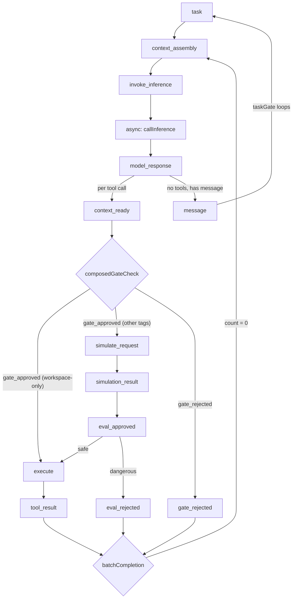
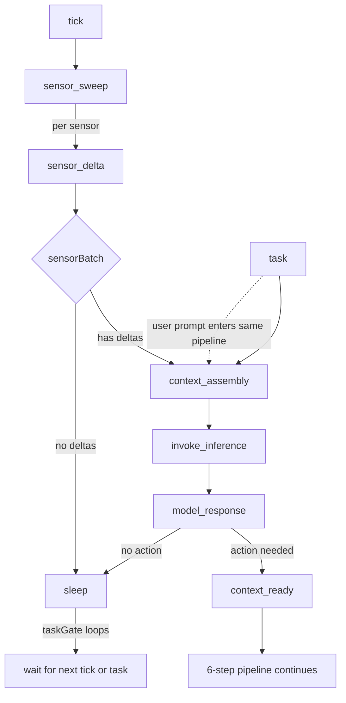

# Event Flow

## Reactive Pipeline

The standard event flow when a user sends a `task`:

**Narrow world view:** Each tool call is an independent scenario. `model_response` triggers one `context_ready` event per tool call, each flowing through its own pipeline. `batchCompletion` waits for all N to resolve, then triggers `context_assembly` for the next inference call.

**Pipeline pass-through:** Events always flow through the full simulate → evaluate → execute pipeline. When a seam is absent, the handler passes through via optional chaining — no conditional routing.

## Proactive Pipeline

When heartbeat mode is active, `tick` events enter the same pipeline through a sensor sweep:

## Event Vocabulary — Core Pipeline

| Event | Produced by | Consumed by | Notes |
|-------|-------------|-------------|-------|
| `task` | External trigger | `taskGate` bThread | Entry point for reactive mode |
| `context_assembly` | `batchCompletion` request | Context contributor handlers | Assembles model prompt |
| `invoke_inference` | Context assembly completion | Inference handler | Calls `Model.reason()` |
| `model_response` | Inference handler | Response parser | Contains `<think>` + tool calls |
| `context_ready` | Response parser (×N) | Gate handler | One per tool call |
| `gate_approved` | Gate handler | Execute or simulate | Risk-tag-routed |
| `gate_rejected` | Gate handler | `batchCompletion` | Feeds rejection reason back to context |
| `simulate_request` | Gate handler | Dreamer | State Transition Prompt |
| `simulation_result` | Dreamer | Judge | Predicted state changes |
| `eval_approved` | Judge | Execute handler | Both 5a and 5b passed |
| `eval_rejected` | Judge | `batchCompletion` | Feeds evaluation reason back to context |
| `execute` | Pipeline routing | Sandboxed subprocess | Only after all gates approve |
| `tool_result` | Execute handler | `batchCompletion` | Output returns as new context |
| `message` | Model (text-only response) | `taskGate` | Completes the task cycle |

## Event Vocabulary — Proactive Extensions

| Event | Produced by | Consumed by | Notes |
|-------|-------------|-------------|-------|
| `tick` | `setInterval` timer | Tick handler | Heartbeat entry point |
| `sensor_sweep` | Tick handler | Sensor handlers | Triggers parallel sensor reads |
| `sensor_delta` | Individual sensors | Goal bThreads, `sensorBatch` | Only when changes detected |
| `sleep` | No deltas / no action | `taskGate` | Agent remains idle |
| `set_heartbeat` | Model tool call | Execute handler | Reconfigures timer interval |

## Event Vocabulary — Memory Lifecycle

| Event | Produced by | Consumed by | Notes |
|-------|-------------|-------------|-------|
| `commit_snapshot` | Side-effect tool execution | Memory handler | `git add` + `git commit` + SHA |
| `consolidate` | Session end / threshold | Memory handler | Decisions → JSONL, meta.jsonld |
| `defrag` | Manual or scheduled | Memory handler | Archive old sessions |
| `snapshot_committed` | Memory handler | Terminal | Commit vertex written |
