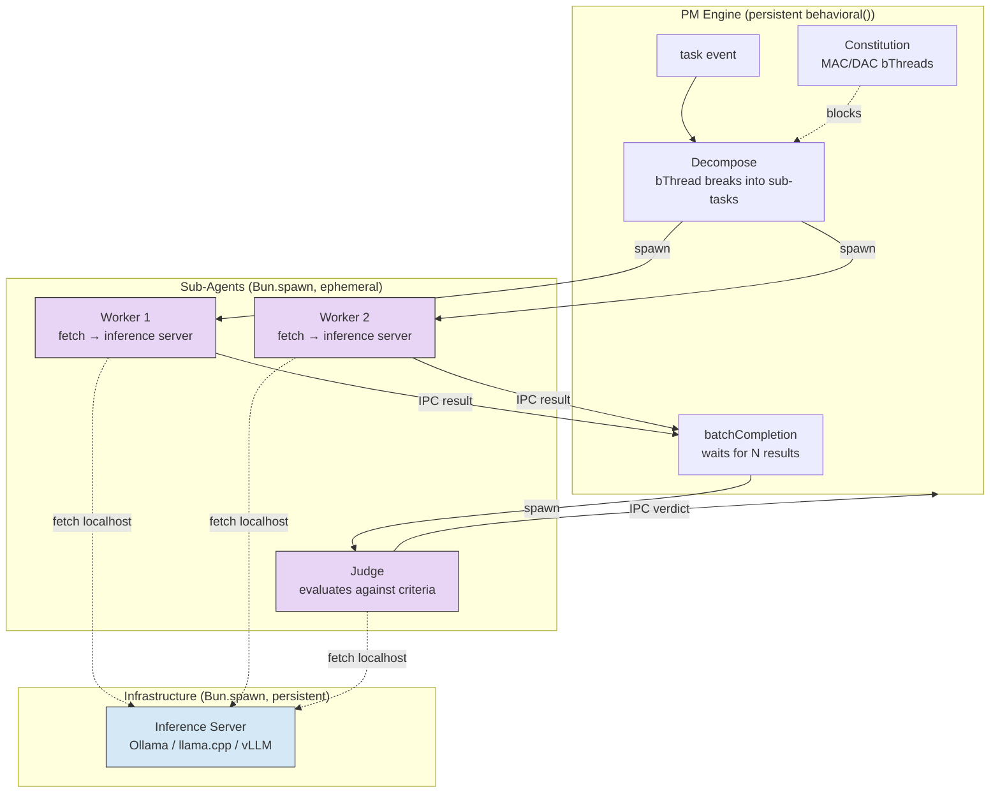

# Sub-Agent Coordination (4-Step Harness)

The PM decomposes complex tasks into sub-tasks, each handled by a `Bun.spawn()` sub-agent. The harness maps to BP:

1. **Decompose** — PM reads task context, breaks into sub-tasks via bThread coordination
2. **Parallelize** — Spawn sub-agent processes (each calls local inference server via `fetch`)
3. **Verify** — Judge sub-agent evaluates results against acceptance criteria
4. **Iterate** — On failure, spawn FRESH sub-agent with error context (new process, clean context window)

## SubAgentHandle Interface

Sub-agents communicate with the PM via the `SubAgentHandle` interface (see `ARCHITECTURE.md` § Runtime Hierarchy). IPC uses `serialization: "advanced"` (JSC structured clone). The inference server is a persistent process on the same box — sub-agents call it via `fetch("http://localhost:PORT")`, making inference async I/O from the sub-agent's perspective.

## Key Design Decisions

- **Crash isolation:** Each sub-agent is a `Bun.spawn()` process. If it crashes, the PM's `behavioral()` engine continues — the IPC channel reports the failure.
- **Fresh context on retry:** On failure, spawn a FRESH sub-agent (new process, clean context window) with error context from the previous attempt. Don't retry in the same process.
- **PM bThreads only:** Sub-agents run as minimal inference runners. All structural coordination (task lifecycle, batch completion, constitution enforcement) lives in the PM's bThreads.
- **Inference server locality:** The inference server (`Ollama`, `llama.cpp`, `vLLM`) runs as a persistent `Bun.spawn()` on the same box. Sub-agents call it via `fetch("http://localhost:PORT")` — no network hops, no auth overhead.
