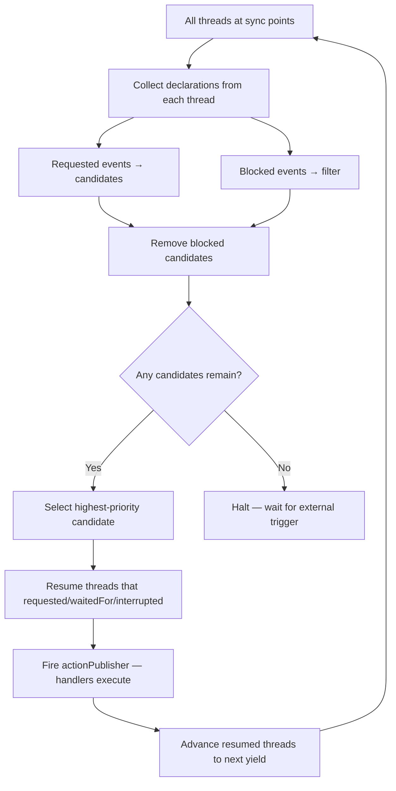
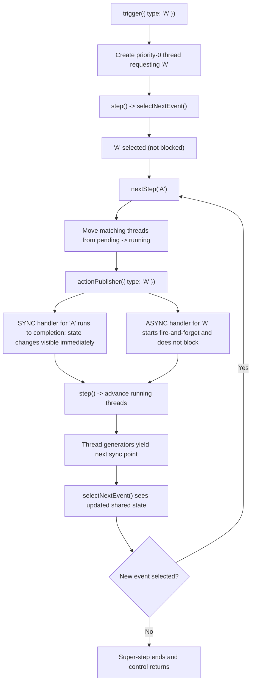
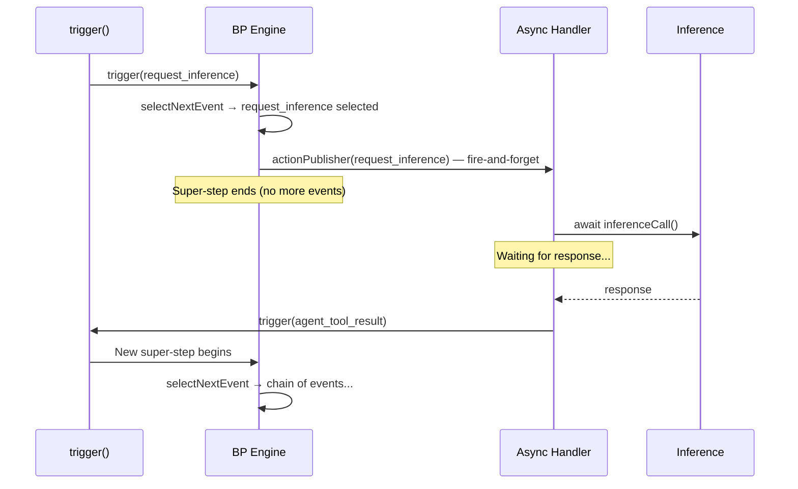

# Behavioral Programming: Algorithm Reference

Reference document synthesizing the BP paradigm as implemented in `src/behavioral/` — drawn from academic papers, source code analysis, and test exploration.

## The Core Algorithm

A behavioral program is a collection of **b-threads** — independent sequential threads of execution that synchronize via a central event arbiter. The algorithm proceeds in **super-steps**:



### The Three Synchronization Idioms

At each sync point, a b-thread declares:

| Idiom | Meaning | Effect |
|-------|---------|--------|
| **request** | "I want this event to happen" | Becomes a candidate for selection |
| **waitFor** | "Wake me if this event is selected" | Thread resumes but doesn't propose |
| **block** | "This event must NOT happen" | Removes matching candidates — **takes precedence over request** |

Plus a fourth idiom: **interrupt** — "if this event is selected, terminate my generator."

### Formal Definition (from Harel, Marron, Weiss)

A b-thread `BT = ⟨S, E, →, init, R, B⟩` where:
- `S` = set of states (synchronization points)
- `E` = global event set
- `→` = transition relation (waitFor edges)
- `R: S → 2^E` = requested events per state
- `B: S → 2^E` = blocked events per state

A behavioral program `P = {BT_1, ..., BT_n}`. An event `e` is **enabled** in configuration `γ` iff:

```
e ∈ ⋃ R_i(q_i) − ⋃ B_i(q_i)
```

That is: requested by at least one thread AND blocked by none.

### Priority-Based Selection (Plaited's Strategy)

Plaited uses a priority queue: lower number = higher priority.

- **Triggered events** (external via `trigger()`) get priority `0` (highest)
- **Thread requests** get priority based on registration order (`running.size + 1` at `bThreads.set()` time)
- When multiple candidates survive blocking, the lowest-priority-number wins

```typescript
// behavioral.ts line 299
const selectedEvent = filteredBids.sort(
  ({ priority: priorityA }, { priority: priorityB }) => priorityA - priorityB,
)[0]
```

### Super-Step Execution Model

A super-step is a chain of internal events that runs to completion before accepting new external input:

1. External event enters via `trigger()` → creates priority-0 thread
2. `step()` advances running threads → `selectNextEvent()`
3. If event selected → `nextStep()` → `actionPublisher()` → `step()` → loop
4. If no event selected → super-step ends, system halts

**Key timing**: `actionPublisher()` fires BEFORE `step()`. This means:
- Sync handlers complete before threads advance
- Shared state set in handlers IS visible to predicates in the next `selectNextEvent()` call
- Async handlers are fire-and-forget (`void cb(value)`) — they do NOT block the super-step

## The `repeat` Parameter

```typescript
bThread(rules, repeat)
```

| Value | Behavior | Generator `done` |
|-------|----------|-------------------|
| `false` / omitted | Rules run once, then thread terminates | `true` after last rule |
| `true` | Rules wrap in `while(true)`, thread never terminates | Never `true` |
| `() => boolean` | Rules repeat while function returns `true` | `true` when predicate returns `false` |

**Critical mechanism**: In `step()` (line 252-253):

```typescript
const { value, done } = generator.next()
!done && pending.set(thread, { ... })
```

When `done === true`, the thread is NOT re-added to `pending` — it disappears. With `repeat=true`, the generator loops forever, so `done` is never `true`.

### When to Use `repeat=true`

Use `repeat=true` for **persistent constraints** that must remain active throughout the program's lifetime:

- Turn enforcement: `waitFor: 'X', block: 'O'` → `waitFor: 'O', block: 'X'` (tic-tac-toe)
- Safety nets: `waitFor: dangerous_event` → `block: all_events` (stopGame pattern)
- Continuous validation: pure-blocking predicates that check state every cycle

Use `repeat=false` (or omit) for **one-shot sequences** that should terminate:

- Counting N occurrences (e.g., a completion thread waits for N `agent_tool_result` events)
- Per-square occupation tracking (tic-tac-toe `squaresTaken`)
- Win detection threads that fire once

## Key Patterns

### Pattern 1: stopGame / doneGuard

```typescript
// Tic-tac-toe: after 'win', block all moves forever
const stopGame = bThread([
  bSync({ waitFor: 'win' }),
  bSync({ block: ['X', 'O'] }),
], true)  // repeat=true: after blocking, loops back to waitFor 'win'

// Agent equivalent: after disconnect, block all events forever
const doneGuard = bThread([
  bSync({ waitFor: AGENT_EVENTS.agent_disconnect }),
  bSync({ block: () => true }),  // predicate blocks EVERYTHING
], true)
```

**How it works**:
1. Thread starts at `waitFor: 'win'` — dormant, not blocking anything
2. When `win` is selected → thread advances to `block: ['X', 'O']`
3. Block is active → all `X` and `O` candidates are filtered out
4. With `repeat=true`, after the block sync, it loops back to `waitFor: 'win'`
5. But since `block` has no `request` or `waitFor`, the thread stays at the block indefinitely

**Why `repeat=true` matters for doneGuard**: If `repeat=false`, the block sync is the last rule. After the blocking generator yields, there's no more code. The generator would return `done: true` on the NEXT advance — but the thread won't advance because it has no `waitFor` or `request` that would match any event. However, `repeat=true` provides defense-in-depth: even if the thread somehow advanced, it would loop back to `waitFor: 'agent_disconnect'` and wait there safely.

### Ephemeral vs Persistent Blocks

**Critical discovery**: A block on a sync point that also has a `request` is **ephemeral** — it only exists at that sync point. Once the requested event fires, the thread advances, and the block disappears.

```typescript
// EPHEMERAL: block only exists until 'terminal' is selected
bSync({
  block: AGENT_EVENTS.write_file,
  request: { type: 'terminal' },
})
// After 'terminal' fires → thread advances → block on 'write_file' gone
// If no more rules → thread removed from pending entirely
```

This is why a terminal request alone is NOT sufficient to permanently block events. It counts N events and requests `agent_disconnect`, but after `agent_disconnect` fires, the thread is done and its block vanishes. The `doneGuard` must take over:

```typescript
// completionCounter: counter + trigger (ephemeral block)
completionCounter: bThread([
  ...Array.from({ length: N }, () => bSync({ waitFor: AGENT_EVENTS.agent_tool_result })),
  bSync({ block: AGENT_EVENTS.write_file, request: { type: AGENT_EVENTS.agent_disconnect } }),
])

// doneGuard: persistent block (takes over after disconnect fires)
doneGuard: bThread([
  bSync({ waitFor: AGENT_EVENTS.agent_disconnect }),
  bSync({ block: () => true }),
], true)
```

The two threads compose additively: completionCounter triggers the `agent_disconnect` event,
doneGuard picks it up and blocks everything permanently.

### Infinite Super-Step Anti-Pattern

A `repeat=true` thread that continuously `request`s events creates an infinite synchronous super-step (stack overflow):

```typescript
// ANTI-PATTERN: infinite loop — DO NOT DO THIS
worker: bThread(
  [bSync({ request: { type: 'work' } })],
  true,
)
// selectNextEvent → 'work' selected → step → selectNextEvent → 'work' → ... (stack overflow)
```

In the agent, all events flow from `trigger()` calls in feedback handlers. There are NO continuously-requesting threads. The event chain is broken by async work (inference calls), which returns control from the super-step and starts a new one when the promise resolves.

### Pattern 2: Shared State with Block Predicates

```typescript
// Tic-tac-toe: board is shared between handlers and predicates
const board = new Map<number, null>()  // tracks occupied squares

bThreads.set({
  squaresTaken: bThread([
    bSync({ waitFor: (e) => board.has(Number(e.type)) }),  // predicate reads board
    bSync({ block: (e) => board.has(Number(e.type)) }),    // predicate reads board
  ]),
})

useFeedback({
  X: (detail) => { board.delete(detail.square) },  // handler modifies board
  O: (detail) => { board.delete(detail.square) },
})
```

**Why this works**: `actionPublisher()` (which fires handlers) runs BEFORE `step()` (which re-evaluates predicates). So when a handler modifies shared state, the next `selectNextEvent()` call sees the updated state.

**Agent equivalent**: a pending-write set is shared between handlers and bThread predicates:

```typescript
// Handler sets state
pendingWrites.add(detail.path)

// bThread predicate reads state
writeGuard: bThread([
  bSync({
    block: (event) => {
      if (event.type !== AGENT_EVENTS.write_file) return false
      return pendingWrites.has(event.detail?.input?.path)
    },
  }),
], true)
```

### Pattern 3: Dynamic Thread Spawning (Dispatcher/Worker)

From the Scaling Up paper: threads can spawn other threads at runtime. In Plaited, this is achieved by calling `trigger()` from feedback handlers — each `trigger()` creates a temporary priority-0 thread.

```typescript
// Handler acts as dispatcher
useFeedback({
  [AGENT_EVENTS.agent_tool_result]: (detail) => {
    for (const output of detail.output) {
      trigger({ type: 'indexed_output', detail: output })
      // Each trigger() creates a new b-thread that requests the event
    }
  },
})
```

This is the behavioral equivalent of spawning a Sender thread per mail in the Scaling Up paper's mail client example.

### Pattern 4: Counter-Based Completion

Use a counting thread to wait for a bounded number of completion events, then
trigger the next phase. This is a general coordination pattern for test
runners, batch pipelines, fanout merges, and agent workflow checkpoints.

```typescript
// Batch completion pattern: wait for N completions, then continue
bThreads.set({
  batchCompletion: bThread([
    ...Array.from({ length: 3 }, () =>
      bSync({
        waitFor: (event) =>
          event.type === AGENT_EVENTS.agent_tool_result ||
          event.type === AGENT_EVENTS.signal_schema_violation,
        interrupt: [AGENT_EVENTS.agent_disconnect],
      }),
    ),
    bSync({
      request: { type: AGENT_EVENTS.request_inference },
      interrupt: [AGENT_EVENTS.agent_disconnect],
    }),
  ]),
})
```

This pattern is preferable to stale external "runner" references because it is
grounded in the current repo's coordination style:

- count a known number of completions
- request the next phase only after the batch is done
- use `interrupt` for clean teardown when the enclosing task ends

**Agent equivalent**: `pendingToolCallCount` reaches 0 → re-invoke inference. Currently done in `checkComplete()` helper, could potentially be expressed as a bThread predicate.

### Pattern 5: Blocking as Coordination

Blocking isn't just for safety — it's a coordination mechanism. A thread can block events to enforce ordering:

```typescript
// Enforce turns: X before O, then O before X
const enforceTurns = bThread([
  bSync({ waitFor: 'X', block: 'O' }),  // allow X, prevent O
  bSync({ waitFor: 'O', block: 'X' }),  // allow O, prevent X
], true)
```

The same pattern applies in the current agent core when a coordination thread needs to defer
`write_file` or `bash` until some prerequisite state is present, such as a signal update or a
tool result.

## Execution Trace: Handler → Thread → Handler

Understanding the exact execution order is critical for correct agent design:



**Key insight for async handlers**: When a feedback handler is async (e.g., it `await`s an
inference call), the handler starts executing but the super-step continues. The handler's
`trigger()` call after the `await` starts a NEW super-step. This is how agent modules handle
async work without blocking the BP engine.

## Async Feedback and the BP Loop

The behavioral engine is **synchronous** — super-steps run to completion. Async work happens outside super-steps via `useFeedback`:



The async handler bridges the synchronous BP world and the asynchronous I/O world. This is exactly the "eager execution" concept from the Relaxing Synchronization paper — the BP engine doesn't wait for slow threads.

## Concepts from the Papers

### Additive Composition (CACM Paper)

The defining property of BP: new behaviors can be added without modifying existing ones.

```typescript
// Wave 1: just completion accounting
bThreads.set({ completionCounter: bThread([...]) })

// Wave 2: add a write guard — doesn't touch completionCounter
bThreads.set({ writeGuard: bThread([...], true) })
bThreads.set({ disconnectGuard: bThread([...], true) })
```

Each bThread is an independent requirement. They compose through the event selection mechanism without knowing about each other.

### Scenario Classification (Adaptive BP)

| Type | Purpose | Agent Equivalent |
|------|---------|-----------------|
| **Goal-Scenarios** | Grant reinforcements, drive learning | — (future: reward-based routing) |
| **Base-Scenarios** | Affect run, no reinforcements | `completionCounter`, `writeGuard` |
| **Auxiliary-Scenarios** | Monitor only, don't participate in selection | `useSnapshot` listeners |

### Pluggable Event Selection Strategies (BPjs, Scaling Up)

The event selection mechanism is a parameter, not fixed. Plaited uses priority-based selection, but the architecture supports alternatives:

- **Priority queue** (current): lowest priority number wins
- **Reinforcement learning** (Adaptive BP): Q-values vote for enabled events
- **Look-ahead** (Smart Play-Out): search future states to avoid deadlocks
- **Custom** (Scaling Up): programmer-supplied function `f: Γ* × Γ → E`

### Context Through Events (COBP, Decentralized Control)

BP's formal model says b-threads communicate ONLY through events. In practice,
Plaited also allows runtime state to be observed through local closure state,
predicate inputs, and other explicit context surfaces. Examples include shared
maps like `board` in tic-tac-toe or tool-state sets like `pendingWrites` in an
agent module.

The COBP paper formalizes this by adding explicit context idioms — `select`
queries to read context, `update` to change it. This is useful because it makes
state dependencies more visible and easier to verify than purely hidden mutable
closure state.

For Plaited, the practical rule should be:

- closures are acceptable for local implementations
- explicit context inputs are preferred for reusable behavioral modules
- event flow remains the main coordination mechanism

This matters for the newer module-oriented direction of the repo. If a
behavioral module is meant to be generated, validated, reused, or compiled
from symbolic state, it should prefer an explicit context contract over
implicitly shared mutable state where possible.

## Design Principles for the Agent Refactor

1. **Threads for coordination, handlers for side effects** — bThreads express WHEN and IF; handlers express WHAT. A handler should be a thin side-effect runner, not a decision-maker.

2. **Block instead of `if (done) return`** — A `doneGuard` bThread can eliminate manual
done-checking. When `agent_disconnect` fires, the block activates and prevents any further events
from being selected.

3. **Events as the only control flow** — Instead of calling coordination helpers from multiple
handlers, trigger an event such as `request_inference`. The handler for that event does the
inference. This makes the control flow visible to `useSnapshot`.

4. **Repeat for constraints, finite for sequences** — Persistent safety/coordination threads use
`repeat=true`. Counting threads like `completionCounter` use finite sequences.

5. **Defense-in-depth through additive composition** — a persistent guard thread can be redundant
with a handler-level validation check. This is by design: the handler check is the primary defense,
the bThread is a safety net. Both are independent requirements composed additively.

## References

- Harel, Marron, Weiss. "Behavioral Programming" (CACM 2012) — Foundational paper
- Harel, Marron, Weiss. "Programming Coordinated Behavior in Java" (ECOOP 2010) — BPJ library
- Bar-Sinai, Weiss. "Decentralized Control" (AGERE 2011) — Formal definitions, composition
- Harel, Katz. "Relaxing Synchronization" (2013) — Eager execution, multiple time scales
- Eitan, Harel. "Adaptive Behavioral Programming" (ICTAI 2011) — RL + BP integration
- Harel, Katz. "Scaling Up Behavioral Programming" — Web-server case study, extension idioms
- Bar-Sinai, Weiss, Shmuel. "BPjs" (MODELS 2018) — Unified framework, event selection strategies
- Elyasaf. "Context-Oriented Behavioral Programming" (IST 2021) — Context idioms for BP
