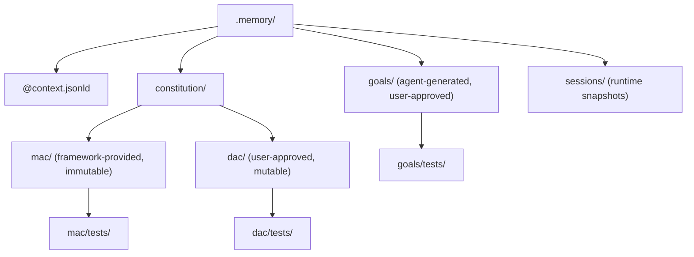

# Generated bThreads

The agent generates bThreads as **TypeScript files with companion tests**, not declarative data. The verification stack makes code generation as safe as data generation while being far more expressive.

## Categories

| Category | Brand | Loaded at | Mutable | Approval | Example |
|----------|-------|-----------|---------|----------|---------|
| MAC Constitution | `🏛️` | Spawn | No | Framework | `noRmRf`, `protectGovernance` |
| DAC Constitution | `🏛️` | Spawn + runtime | Yes | User | `noProductionDeploys` |
| Goals | `🎯` | Spawn + runtime | Yes | User (DAC-style) | `watchAliceEmail`, `serverHealth` |
| Workflows | `🔄` | Runtime | Yes | User (DAC-style) | `dailyReport`, `weeklyDigest` |

All categories use the same contract — a branded factory function returning `{ threads?, handlers? }`. The distinction is brand, mutability, and approval flow — not shape.

## Five-Layer Verification Stack

```
Agent generates .ts file
  │
  ▼
Layer 1: TypeScript Type Check (bun --bun tsc --noEmit)
  │  RulesFunction must yield Idioms (branded 🪢)
  │  bSync params must match { request?, waitFor?, block?, interrupt? }
  │  Factory return type must match { threads?, handlers? }
  │  CATCHES: wrong types, missing fields, bad imports, structural errors
  │
  ▼
Layer 2: LSP Static Analysis (typescript-lsp skill)
  │  No imports outside allowed modules (behavioral types, agent constants)
  │  Exported symbols match expected factory shape
  │  No side effects in factory (no fetch, no fs, no Bun.$)
  │  CATCHES: import violations, symbol misuse, sandboxing
  │
  ▼
Layer 3: Generated Test Execution (bun test)
  │  Agent generates companion .spec.ts alongside the bThread
  │  Test instantiates behavioral(), loads thread, triggers events
  │  Asserts: correct events blocked/allowed, correct lifecycle
  │  CATCHES: behavioral errors, wrong blocking logic, infinite loops
  │
  ▼
Layer 4: Trial/Grader Evaluation (plaited eval)
  │  Run k=10 attempts of "generate bThread for goal X"
  │  Grader: does generated thread pass tsc + bun test?
  │  pass@k = capability, pass^k = reliability
  │  CATCHES: flaky generation, edge cases, training signal
  │
  ▼
Layer 5: BP Runtime (the engine itself)
  │  MAC bThreads block dangerous execute events regardless of source
  │  useSnapshot captures every decision — bad threads are observable
  │  protectGovernance blocks threads that modify MAC
  │  CATCHES: anything that slips through layers 1-4
```

**Verification IS the training signal.** Every generated bThread that passes tsc + tests becomes a positive training example. Every failure becomes a negative example with structured feedback (which layer caught it, what the error was).

## Test-First Generation Flow

The agent generates the test before the thread:

```
1. User: "Watch for emails from Alice"
2. Agent generates: .memory/goals/tests/watch-alice.spec.ts
   - Creates behavioral(), loads thread, triggers sensor_delta events
   - Asserts: fires context_assembly when from includes "alice@example.com"
   - Asserts: does NOT fire for other senders
   - Asserts: repeats after firing
3. Agent runs: bun test → FAILS (no implementation)
4. Agent generates: .memory/goals/watch-alice.ts
5. Agent runs: tsc --noEmit → passes
6. Agent runs: bun test → PASSES
7. Thread loaded into BP engine
```

## File Structure

This is a current starting structure, not a frozen final layout:



## validateAndImport Gate

Before loading any generated thread, `validateAndImport` checks:

1. **Parse** — must be valid TypeScript
2. **Brand check** — must have correct `$` identifier for its directory
3. **Sandbox check** — no imports outside behavioral types and agent constants
4. **Purity check** — factory must be pure (no fetch, no fs, no Bun.$)
5. **MAC protection** — goals cannot block MAC-protected events
6. **Name collision** — cannot shadow existing thread names
7. **Tests pass** — companion `.spec.ts` must exist and pass

## Trial/Grader Integration

bThread generation quality is measurable via the trial runner:

```jsonl
{"id":"goal-email-filter","input":"Generate a goal bThread that watches for emails from alice@example.com","hint":"must repeat, must filter by sender, must produce context_assembly"}
{"id":"dac-no-weekend-deploys","input":"Generate a DAC rule that blocks deploy on weekends","hint":"must use repeat:true, must check day of week"}
```

Grader runs tsc + bun test on the generated output. pass@k measures capability; pass^k measures reliability. This feeds the augmented self-distillation pipeline.
