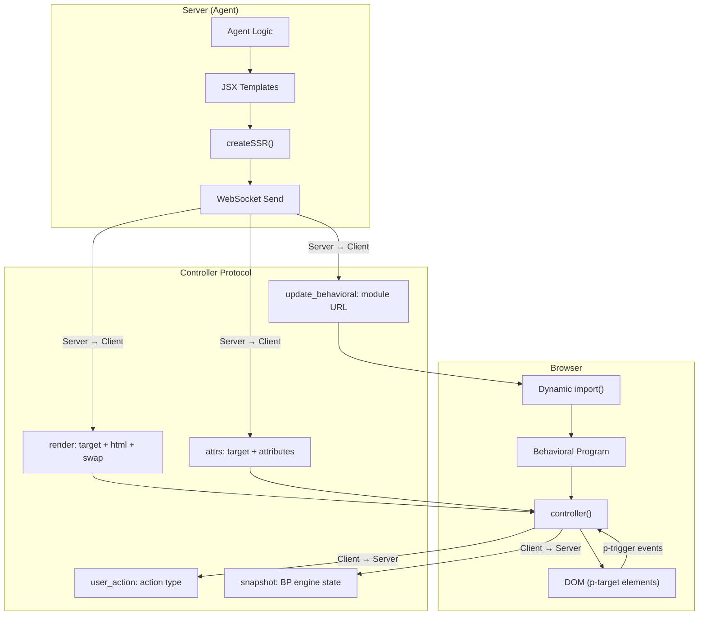
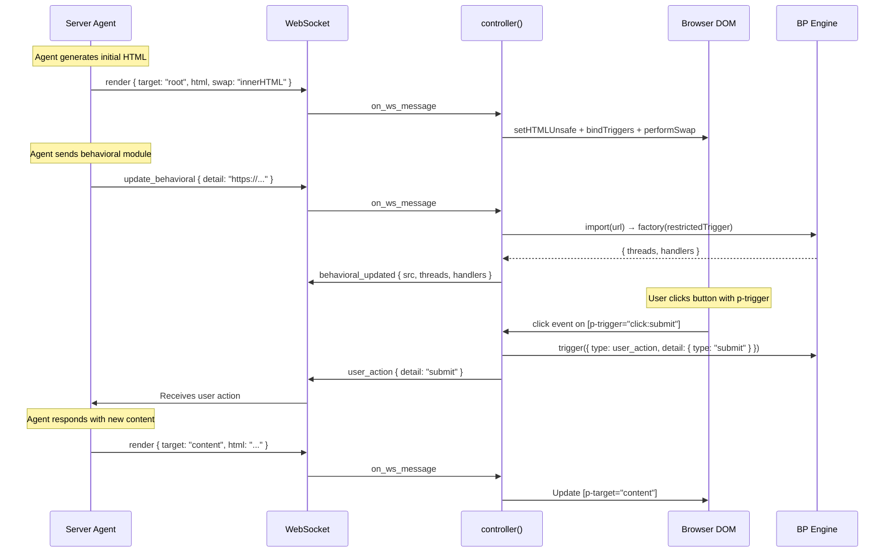

# Generative UI

## Purpose

This skill guides AI agents and developers through Plaited's **server-driven generative UI** pattern. An agent generates HTML on the server, streams it to the browser over WebSocket, and optionally injects client-side behavioral logic — all through a typed protocol.

**Use this when:**
- Building an agent that generates and streams UI to a browser
- Implementing server → client rendering via the controller protocol
- Composing `createSSR`, `decorateElements`, and `controlIsland`
- Designing `update_behavioral` flows for dynamic client-side code loading
- Understanding the full message lifecycle (render, attrs, user_action, snapshot)

**Prerequisites:** Familiarity with `behavioral-core` skill for BP fundamentals.

## Quick Reference

| Concern | Server API | Client API |
|---------|-----------|------------|
| Render HTML | `createSSR().render(template)` | `controller()` handles `render` messages |
| Style scoping | `createStyles()`, `createHostStyles()` | Styles injected via `<style>` in rendered HTML |
| Shadow DOM | `decorateElements({ tag, shadowDom })` | Declarative shadow DOM via `<template shadowrootmode>` |
| Interactive elements | `controlIsland({ tag })` | Registers custom element with BP engine |
| Dynamic behavior | Send `update_behavioral` message with URL | `import(url)` → register threads + handlers |
| User events | Receive `user_action` messages | `p-trigger` attribute binds DOM events |
| Attribute updates | Send `attrs` message | `controller()` handles attribute mutations |

## Architecture



## Server-Side Rendering Pipeline

**[server-pipeline.md](references/server-pipeline.md)** - Complete rendering documentation

### 1. Create Templates (JSX)

Plaited uses JSX with two special attributes for server ↔ client coordination:

```typescript
import { createSSR, createStyles, controlIsland, decorateElements } from 'plaited/ui'

// p-target: marks elements the server can update later
// p-trigger: binds DOM events to actions sent to server
const template = (
  <div p-target="main">
    <h1>Dashboard</h1>
    <button p-trigger="click:refresh">Refresh</button>
    <div p-target="content">Loading...</div>
  </div>
)
```

### 2. Render with Style Deduplication

```typescript
// One instance per WebSocket connection
const { render, clearStyles } = createSSR()

// First render: emits <style>...</style> + HTML
const html = render(template)

// Same styled component again: HTML only (styles already sent)
const html2 = render(anotherTemplateUsingSameStyles)

// New connection: reset the dedup tracker
clearStyles()
```

### 3. Send via Protocol

```typescript
// Insert HTML at a target element
ws.send(JSON.stringify({
  type: 'render',
  detail: {
    target: 'content',      // Finds [p-target="content"]
    html: render(newContent),
    swap: 'innerHTML',       // Default; also: afterbegin, beforeend, outerHTML, etc.
  },
}))

// Update attributes surgically
ws.send(JSON.stringify({
  type: 'attrs',
  detail: {
    target: 'content',
    attr: { class: 'loaded', 'aria-busy': false },
  },
}))
```

## Custom Elements

### controlIsland (Interactive Island)

For elements that create an isolated island of control — a custom element with its own BP engine, WebSocket controller, and scoped DOM update surface:

```typescript
const AppShell = controlIsland({
  tag: 'app-shell',
  observedAttributes: ['theme'],
})

// Renders as: <app-shell p-target="...">children</app-shell>
// Client registers custom element with BP engine + controller
const page = render(
  <AppShell>
    <div p-target="main">Initial content</div>
  </AppShell>
)
```

### decorateElements (Presentational)

For elements that need shadow DOM encapsulation without a WebSocket:

```typescript
const Card = decorateElements({
  tag: 'ui-card',
  shadowDom: (
    <>
      <div class={styles.wrapper}>
        <slot name="header" />
        <slot />
      </div>
    </>
  ),
  hostStyles: cardHostStyles,
})

// Renders with declarative shadow DOM:
// <ui-card><template shadowrootmode="open">...</template>children</ui-card>
```

## Script Execution in Dynamic Renders

**Inline `<script>` tags in `render` messages do NOT execute.** This is a browser spec limitation, not a Plaited design choice.

The HTML specification marks scripts inserted via any fragment parsing API (`innerHTML`, `setHTMLUnsafe`, `DOMParser`) as "parser-inserted" and suppresses execution. This applies to ALL content delivered via `render` messages — the controller uses `template.setHTMLUnsafe(html)` → `DocumentFragment` → DOM insertion.

| Method | Script in DOM? | Executes? |
|--------|---------------|-----------|
| `render` message (setHTMLUnsafe) | Yes | **No** |
| `innerHTML` | Yes | **No** |
| `document.createElement('script')` + append | Yes | Yes |
| Initial page load `<script>` | Yes | Yes |

**Implications for agents:**
- `<script>` tags can be included in the **initial HTML page** served over HTTP (they execute normally during page parse)
- For dynamic client-side code after initial load, use `update_behavioral` + `import(url)` — this is the **only** supported path
- Inline event handlers (`onclick`, `onerror`) DO work in rendered HTML, but `p-trigger` is the preferred pattern

## Dynamic Behavioral Code Loading

**[update-behavioral.md](references/update-behavioral.md)** - Complete dynamic loading documentation

This is the key to **generative UI** — the server can command the client to load behavioral code at runtime. Because inline `<script>` tags in render messages are inert (see above), `update_behavioral` is the only mechanism for adding client-side logic after initial page load.

### Server Sends Module URL

```typescript
ws.send(JSON.stringify({
  type: 'update_behavioral',
  detail: 'https://cdn.example.com/modules/form-handler.js',
}))
```

### Client Loads and Registers

The controller handler automatically:
1. `await import(url)` — fetches and evaluates the module
2. Validates: module must have `default` export (factory function)
3. Calls `factory(restrictedTrigger)` — passes a sandboxed trigger
4. Registers returned `{ threads, handlers }` into the BP engine
5. Sends `behavioral_updated` confirmation back to server

### Module Contract

```typescript
// The module the agent generates and serves
import type { Trigger } from 'plaited'
import type { UpdateBehavioralResult } from 'plaited/ui'

const factory = (trigger: Trigger): UpdateBehavioralResult => ({
  threads: {
    'form-submit': bThread([
      bSync({ waitFor: 'user_action' }),
      bSync({ request: { type: 'validate' } }),
    ], true),
  },
  handlers: {
    validate(detail) {
      // Run validation logic
      trigger({ type: 'user_action', detail: { type: 'validated' } })
    },
  },
})

export default factory
```

### Security: restrictedTrigger

Dynamically loaded code receives `restrictedTrigger`, not the full `trigger`. It can only fire:

| Allowed | Blocked |
|---------|---------|
| `user_action` | `render` |
| `behavioral_updated` | `attrs` |
| `root_connected` | `disconnect` |
| `snapshot` | |
| WebSocket lifecycle events | |
| Element callbacks (`on_connected`, etc.) | |

This prevents loaded modules from directly manipulating the DOM — they must go through the BP engine.

## Protocol Message Reference

### Server → Client

| Message | Schema | Purpose |
|---------|--------|---------|
| `render` | `{ target, html, swap? }` | Insert/replace DOM content |
| `attrs` | `{ target, attr: Record<string, string\|number\|boolean\|null> }` | Update element attributes |
| `update_behavioral` | `httpUrl` | Load behavioral module |
| `disconnect` | `undefined` | Tear down shell |

### Client → Server

| Message | Schema | Purpose |
|---------|--------|---------|
| `root_connected` | `string` (element tag) | Report root element type |
| `user_action` | `string` (action type) | User triggered an action |
| `behavioral_updated` | `{ src, threads?, handlers? }` | Module loaded successfully |
| `snapshot` | `SnapshotMessage` | BP engine observability |

### Swap Modes

| Mode | Behavior |
|------|----------|
| `innerHTML` | Replace element's children (default) |
| `outerHTML` | Replace the element itself |
| `afterbegin` | Prepend inside element |
| `beforeend` | Append inside element |
| `afterend` | Insert after element |
| `beforebegin` | Insert before element |

## End-to-End Flow



## Style System Integration

Styles are generated server-side and deduplicated per connection:

```typescript
const styles = createStyles({
  card: { padding: '16px', borderRadius: '8px' },
  title: { fontSize: '1.25rem', fontWeight: 'bold' },
})

const hostStyles = createHostStyles({
  display: 'block',
  ':hover': { boxShadow: '0 2px 8px rgba(0,0,0,0.1)' },
})

// createSSR handles dedup — same stylesheet sent once per connection
const { render } = createSSR()
const html = render(<div {...styles.card}><h2 {...styles.title}>Hello</h2></div>)
// First call: <style>.card_abc{...}.title_def{...}</style><div class="card_abc">...
// Second call with same styles: <div class="card_abc">... (no <style>)
```

### Shadow DOM Style Scoping

`decorateElements` inverts `createSSR`'s `:host` → `:root` replacement:
- Server renders with `:root{` selectors (works in light DOM SSR)
- `decorateElements` converts `:root{` → `:host{` for shadow DOM scope
- `createSSR.render()` converts `:host{` → `:root{` when sending to client

## Related Skills

- **behavioral-core** - BP fundamentals (bThread, bSync, event selection)
- **typescript-lsp** - Type verification for protocol schemas
- **code-documentation** - TSDoc standards for generated code
