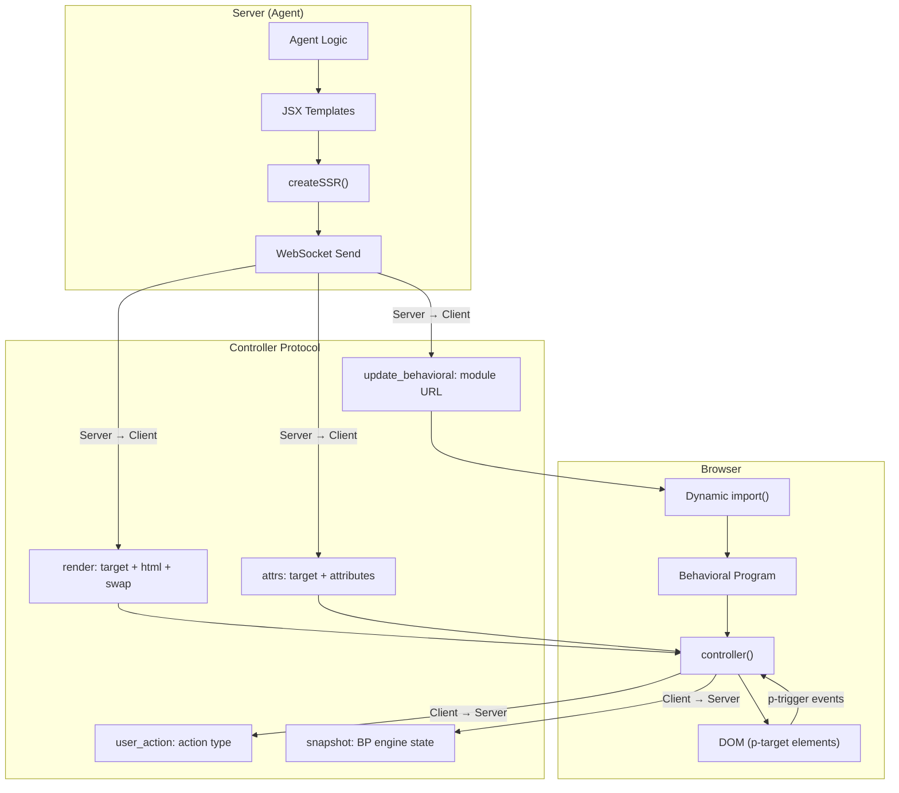
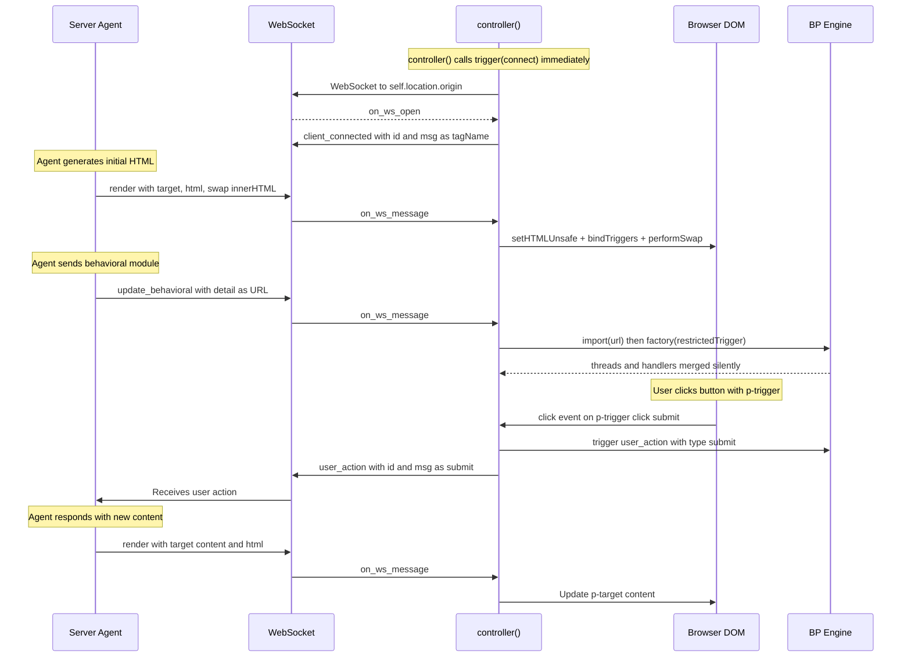

# Generative UI

## Purpose

This skill guides AI agents and developers through Plaited's **server-driven generative UI** pattern. An agent generates HTML on the server, streams it to the browser over WebSocket, and optionally injects client-side behavioral logic — all through a typed protocol.

**Use this when:**
- Building an agent that generates and streams UI to a browser
- Implementing server → client rendering via the controller protocol
- Composing `createSSR`, `decorateElements`, and `controlIsland`
- Designing `update_behavioral` flows for dynamic client-side code loading
- Understanding the full message lifecycle (render, attrs, user_action, snapshot)

**Prerequisites:** Familiarity with `behavioral-core` skill for BP fundamentals.

## Quick Reference

| Concern | Server API | Client API |
|---------|-----------|------------|
| Render HTML | `createSSR().render(template)` | `controller()` handles `render` messages |
| Style scoping | `createStyles()`, `createHostStyles()` | Styles injected via `<style>` in rendered HTML |
| Shadow DOM | `decorateElements({ tag, shadowDom })` | Declarative shadow DOM via `<template shadowrootmode>` |
| Interactive elements | `controlIsland({ tag })` | Registers custom element with BP engine |
| Dynamic behavior | Send `update_behavioral` message with URL | `import(url)` → register threads + handlers |
| User events | Receive `user_action` messages | `p-trigger` attribute binds DOM events |
| Attribute updates | Send `attrs` message | `controller()` handles attribute mutations |

## Architecture


```mermaid
flowchart TB
    subgraph Server["Server (Agent)"]
        Agent["Agent Logic"]
        JSX["JSX Templates"]
        SSR["createSSR()"]
        WS_S["WebSocket Send"]
    end

    subgraph Protocol["Controller Protocol"]
        Render["render: target + html + swap"]
        Attrs["attrs: target + attributes"]
        UpdateBP["update_behavioral: module URL"]
        UserAction["user_action: action type"]
        Snapshot["snapshot: BP engine state"]
    end

    subgraph Client["Browser"]
        Controller["controller()"]
        DOM["DOM (p-target elements)"]
        BP["Behavioral Program"]
        DynImport["Dynamic import()"]
    end

    Agent --> JSX --> SSR --> WS_S
    WS_S -->|"Server → Client"| Render & Attrs & UpdateBP
    Render --> Controller --> DOM
    Attrs --> Controller
    UpdateBP --> DynImport --> BP
    DOM -->|"p-trigger events"| Controller
    Controller -->|"Client → Server"| UserAction & Snapshot
    BP --> Controller
```

## Server-Side Rendering Pipeline

**[server-pipeline.md](references/server-pipeline.md)** - Complete rendering documentation

### 1. Create Templates (JSX)

Plaited uses JSX with two special attributes for server ↔ client coordination:

```typescript
import { createSSR, createStyles, controlIsland, decorateElements } from 'plaited'

// p-target: marks elements the server can update later
// p-trigger: binds DOM events to actions sent to server
const template = (
  <div p-target="main">
    <h1>Dashboard</h1>
    <button p-trigger="click:refresh">Refresh</button>
    <div p-target="content">Loading...</div>
  </div>
)
```

### 2. Render with Style Deduplication

```typescript
// One instance per WebSocket connection
const { render, clearStyles } = createSSR()

// First render: emits <style>...</style> + HTML
const html = render(template)

// Same styled component again: HTML only (styles already sent)
const html2 = render(anotherTemplateUsingSameStyles)

// New connection: reset the dedup tracker
clearStyles()
```

### 3. Send via Protocol

The server forwards protocol messages to the client. Message shapes:

```typescript
// Insert HTML at a target element
{ type: 'render', detail: { target: 'content', html: render(newContent), swap: 'innerHTML' } }

// Update attributes surgically
{ type: 'attrs', detail: { target: 'content', attr: { class: 'loaded', 'aria-busy': false } } }
```

<!-- TODO: How the agent produces and the server routes these messages depends on src/server/ design -->

## Custom Elements

### controlIsland (Interactive Island)

For elements that create an isolated island of control — a custom element with its own BP engine, WebSocket controller, and scoped DOM update surface:

```typescript
const AppShell = controlIsland({
  tag: 'app-shell',
  observedAttributes: ['theme'],
})

// Renders as: <app-shell p-target="...">children</app-shell>
// Client registers custom element with BP engine + controller
const page = render(
  <AppShell>
    <div p-target="main">Initial content</div>
  </AppShell>
)
```

### decorateElements (Shadow DOM Decorator)

Moves nodes out of the main DOM to reduce node count, captures styles and layouts, and leverages slots via declarative Shadow DOM. No WebSocket or BP engine — purely structural:

```typescript
const Card = decorateElements({
  tag: 'ui-card',
  shadowDom: (
    <>
      <div class={styles.wrapper}>
        <slot name="header" />
        <slot />
      </div>
    </>
  ),
  hostStyles: cardHostStyles,
})

// Renders with declarative shadow DOM:
// <ui-card><template shadowrootmode="open">...</template>children</ui-card>
```

## Script Execution in Dynamic Renders

**Inline `<script>` tags in `render` messages do NOT execute.** This is a browser spec limitation, not a Plaited design choice.

The HTML specification marks scripts inserted via any fragment parsing API (`innerHTML`, `setHTMLUnsafe`, `DOMParser`) as "parser-inserted" and suppresses execution. This applies to ALL content delivered via `render` messages — the controller uses `template.setHTMLUnsafe(html)` → `DocumentFragment` → DOM insertion.

| Method | Script in DOM? | Executes? |
|--------|---------------|-----------|
| `render` message (setHTMLUnsafe) | Yes | **No** |
| `innerHTML` | Yes | **No** |
| `document.createElement('script')` + append | Yes | Yes |
| Initial page load `<script>` | Yes | Yes |

**Implications for agents:**
- `<script>` tags can be included in the **initial HTML page** served over HTTP (they execute normally during page parse)
- For dynamic client-side code after initial load, use `update_behavioral` + `import(url)` — this is the **only** supported path
- Inline event handlers (`onclick`, `onerror`) DO work in rendered HTML, but `p-trigger` is the preferred pattern

## Dynamic Behavioral Code Loading

**[update-behavioral.md](references/update-behavioral.md)** - Complete dynamic loading documentation

This is the key to **generative UI** — the server can command the client to load behavioral code at runtime. Because inline `<script>` tags in render messages are inert (see above), `update_behavioral` is the only mechanism for adding client-side logic after initial page load.

### Server Sends Module URL

```typescript
// Behavioral modules are project-local files served by the server
{ type: 'update_behavioral', detail: '/modules/form-handler.js' }
```

### Client Loads and Registers

The controller handler automatically:
1. `await import(url)` — fetches and evaluates the module
2. Validates: module must have `default` export (factory function) via `UpdateBehavioralModuleSchema`
3. Calls `factory(restrictedTrigger)` — passes a sandboxed trigger
4. Validates returned value via `UpdateBehavioralResultSchema`
5. Merges `threads` into `bThreads.set()` and `handlers` into `useFeedback()`

No confirmation message is sent back — the merge is silent. The server observes success via subsequent client behavior or snapshot messages.

### Module Contract

```typescript
// The module the agent generates and serves
import type { Trigger } from 'plaited'
import type { UpdateBehavioralResult } from 'plaited'

const factory = (trigger: Trigger): UpdateBehavioralResult => ({
  threads: {
    'form-submit': bThread([
      bSync({ waitFor: 'user_action' }),
      bSync({ request: { type: 'validate' } }),
    ], true),
  },
  handlers: {
    validate(detail) {
      // Run validation logic
      trigger({ type: 'user_action', detail: { type: 'validated' } })
    },
  },
})

export default factory
```

### Security: restrictedTrigger

Dynamically loaded code receives `restrictedTrigger`, not the full `trigger`. `useRestrictedTrigger` takes the list of events to **block** — everything else passes through:

| Blocked (`RESTRICTED_EVENTS` + `ELEMENT_CALLBACKS`) | Allowed (passes through) |
|------------------------------------------------------|--------------------------|
| `client_connected`, `user_action`, `snapshot` | `render`, `attrs` |
| `connect`, `retry`, `on_ws_open`, `on_ws_message`, `on_ws_error` | `update_behavioral`, `disconnect` |
| `on_connected`, `on_disconnected`, `on_adopted`, `on_attribute_changed` | Any custom event types |
| `on_form_associated`, `on_form_disabled`, `on_form_reset`, `on_form_state_restore` | |

Loaded modules participate in BP event coordination (can request renders, attribute updates) but cannot fire client→server messages, WebSocket lifecycle events, or element callbacks directly.

## Protocol Message Reference

### Server → Client

| Message | Schema | Purpose |
|---------|--------|---------|
| `render` | `{ target, html, swap? }` | Insert/replace DOM content |
| `attrs` | `{ target, attr: Record<string, string\|number\|boolean\|null> }` | Update element attributes |
| `update_behavioral` | `httpUrl` | Load behavioral module |
| `disconnect` | `undefined` | Tear down shell |

### Client → Server

All client→server messages use `{ id: string, msg: ... }` envelope format:

| Message | Envelope Detail | Purpose |
|---------|----------------|---------|
| `client_connected` | `{ id, msg: tagName }` | Handshake — tag name or `'document'` |
| `user_action` | `{ id, msg: actionType }` | User triggered a `p-trigger` action |
| `snapshot` | `{ id, msg: SnapshotMessage }` | BP engine observability (all decisions) |

### Swap Modes

| Mode | Behavior |
|------|----------|
| `innerHTML` | Replace element's children (default) |
| `outerHTML` | Replace the element itself |
| `afterbegin` | Prepend inside element |
| `beforeend` | Append inside element |
| `afterend` | Insert after element |
| `beforebegin` | Insert before element |

## End-to-End Flow


```mermaid
sequenceDiagram
    participant Agent as Server Agent
    participant WS as WebSocket
    participant Ctrl as controller()
    participant DOM as Browser DOM
    participant BP as BP Engine

    Note over Ctrl: controller() calls trigger(connect) immediately
    Ctrl->>WS: WebSocket to self.location.origin
    WS-->>Ctrl: on_ws_open
    Ctrl->>WS: client_connected with id and msg as tagName

    Note over Agent: Agent generates initial HTML
    Agent->>WS: render with target, html, swap innerHTML
    WS->>Ctrl: on_ws_message
    Ctrl->>DOM: setHTMLUnsafe + bindTriggers + performSwap

    Note over Agent: Agent sends behavioral module
    Agent->>WS: update_behavioral with detail as URL
    WS->>Ctrl: on_ws_message
    Ctrl->>BP: import(url) then factory(restrictedTrigger)
    BP-->>Ctrl: threads and handlers merged silently

    Note over DOM: User clicks button with p-trigger
    DOM->>Ctrl: click event on p-trigger click submit
    Ctrl->>BP: trigger user_action with type submit
    Ctrl->>WS: user_action with id and msg as submit
    WS->>Agent: Receives user action

    Note over Agent: Agent responds with new content
    Agent->>WS: render with target content and html
    WS->>Ctrl: on_ws_message
    Ctrl->>DOM: Update p-target content
```

## CSS System

**[css-system.md](references/css-system.md)** - Complete CSS utility documentation

Five utilities in `src/ui/css/` generate styles at template creation time:

| Utility | Purpose |
|---------|---------|
| `createStyles` | Atomic CSS from style objects — hashed class names, media queries, pseudo-classes, attribute selectors |
| `createTokens` | Design tokens as CSS custom properties — `--ident-prop` vars, `:root{}` declarations |
| `createHostStyles` | Host-element-scoped styles for Shadow DOM (`:host{}` rules) |
| `createKeyframes` | `@keyframes` generation with hashed names |
| `joinStyles` | Combines host styles with stylesheet arrays |

Styles are collected into `TemplateObject.stylesheets[]` and deduplicated per connection by `createSSR()`:

```typescript
const styles = createStyles({
  card: { padding: '16px', borderRadius: '8px' },
  title: { fontSize: '1.25rem', fontWeight: 'bold' },
})

// createSSR handles dedup — same stylesheet sent once per connection
const { render } = createSSR()
const html = render(<div {...styles.card}><h2 {...styles.title}>Hello</h2></div>)
// First call: <style>.card_abc{...}.title_def{...}</style><div class="card_abc">...
// Second call with same styles: <div class="card_abc">... (no <style>)
```

### Shadow DOM Style Scoping

`decorateElements` inverts `createSSR`'s `:host` → `:root` replacement:
- Server renders with `:root{` selectors (works in light DOM SSR)
- `decorateElements` converts `:root{` → `:host{` for shadow DOM scope
- `createSSR.render()` converts `:host{` → `:root{` when sending to client

## Document-Level Controller

### `controlDocument` — MPA View Transitions

`src/ui/dom/control-document.ts`

Document-scoped behavioral controller for multi-page applications with view transitions. Creates a BP engine on `document`, wires up the WebSocket controller, and listens for navigation events on `window`.

- **`pageswap`** — always tears down the disconnect set (cleanup on navigation)
- **`pagereveal`** — optional `onPageReveal` factory receives `restrictedTrigger` and returns the handler
- **`DOCUMENT_EVENTS`:** `on_pagereveal`, `on_pageswap`

Use `controlDocument` when you need document-level coordination across islands (e.g., shared navigation state, cross-island communication, MPA view transition hooks).

## DelegatedListener

`src/ui/dom/delegated-listener.ts`

Minimal `EventListener` implementation with a `WeakMap`-based delegate registry. Elements and WebSockets are stored as weak keys — when the target is garbage collected, the listener reference is automatically cleaned up. Used internally by the controller protocol to manage event delegation without manual cleanup.

## Modnet Integration

The Modnet vocabulary maps directly to UI primitives:

| Modnet Concept | UI Primitive |
|----------------|-------------|
| **Module** (front+back-end unit) | `controlIsland` — each island is an independent behavioral program with its own WebSocket |
| **Content Type** (MSS tag) | Template content generated by the agent via `createTemplate`/`h` |
| **Structure** (MSS tag) | `decorateElements` for DOM organization + slots; `p-target` addressing for server updates |
| **Mechanics** (MSS tag) | `update_behavioral` — agent generates and loads behavioral code at runtime |
| **Boundary** (MSS tag) | `restrictedTrigger` enforces what dynamically loaded code can do |
| **Scale** (MSS tag) | `createTokens` design token system; `controlDocument` for document-level coordination |

Modules are generated by the agent for nodes. The agent produces both the HTML structure (via SSR) and the behavioral logic (via `update_behavioral`), composing them into Modnet modules delivered to the client over WebSocket.

## WebSocket Architecture

**[websocket-decisions.md](references/websocket-decisions.md)** - Resolved design decisions and rationale

Eight architectural decisions govern the WebSocket layer. All are resolved and implemented:

| Decision | Resolution | Implementation |
|----------|-----------|----------------|
| WS routing | Single `/ws` + Bun pub/sub | `src/server/server.ts` |
| Flicker prevention | SSR is truth; WS sends deltas only | Architecture-level |
| Network detection | Controller retry loop + `navigator.onLine` | `src/ui/protocol/controller.ts` |
| MPA + session | Cookie session ID | `src/server/server.ts` |
| State fast-forward | Full SSR per page + replay buffer | `src/server/server.ts` |
| Injection prevention | Template escaping + CSP headers | `src/ui/render/template.ts`, `src/server/server.ts` |
| Protocol format | JSON (envelope overhead negligible) | Architecture-level |
| Token security | Origin validation + CSP + HttpOnly | `src/server/server.ts` |

## Related Skills

- **behavioral-core** - BP fundamentals (bThread, bSync, event selection)
- **ui-testing** - Three-layer test strategy for UI components and controller protocol
- **typescript-lsp** - Type verification for protocol schemas
- **code-documentation** - TSDoc standards for generated code
