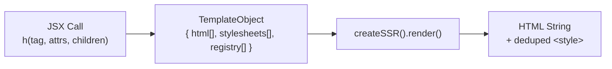

# Server-Side Rendering Pipeline

## Overview

The server pipeline converts JSX templates into HTML strings with per-connection style deduplication. An agent uses this pipeline to generate UI that streams to the browser over WebSocket.

## Pipeline Stages



### Stage 1: Template Creation

JSX calls produce `TemplateObject` values — not DOM nodes.

```typescript
type TemplateObject = {
  html: string[]        // HTML fragments (concatenated at render)
  stylesheets: string[] // CSS text from createStyles/createHostStyles
  registry: string[]    // Custom element tags used (for hydration)
  $: '🦄'              // Identifier marker
}
```

**Key behaviors:**
- Text children are HTML-escaped by default (XSS prevention)
- `trusted={true}` on `<script>` bypasses escaping
- `on*` event handlers throw (use `p-trigger` instead)
- Boolean attributes emit presence/absence (not `="true"`)
- Void elements (`<br>`, ``, etc.) have no closing tag

### Stage 2: Style Collection

When styled elements appear in a template, their CSS is collected into `stylesheets[]`:

```typescript
const styles = createStyles({
  card: { padding: '16px', borderRadius: '8px' },
})

// <div {...styles.card} /> produces:
// html: ['<div class="card_abc"></div>']
// stylesheets: ['.card_abc{padding:16px;border-radius:8px}']
```

Styles from `createHostStyles` and design tokens (`createTokens`) are also collected via the spread operator.

### Stage 3: Rendering with Deduplication

`createSSR()` maintains a `Set<string>` of sent stylesheets per connection:

```typescript
const renderTemplates = (sent: Set<string>, templates: TemplateObject[]) => {
  const fresh: string[] = []
  for (const template of templates) {
    for (const sheet of template.stylesheets) {
      if (sent.has(sheet)) continue  // Already sent on this connection
      fresh.push(sheet)
      sent.add(sheet)
    }
  }
  // Inject <style> before </head> or after <body>
  const style = fresh.length
    ? `<style>${fresh.join('').replaceAll(/:host\{/g, ':root{').replaceAll(/:host\(([^)]+)\)/g, ':root$1')}</style>`
    : ''
  // ...insert style at correct position in HTML
}
```

**`:host` → `:root` replacement:**
- Shadow DOM styles use `:host{` for scoping
- In SSR (light DOM), `:host` has no meaning
- `createSSR` converts to `:root{` which applies globally
- This is reversed by `decorateElements` for shadow DOM contexts

### Stage 4: Style Injection Position

The rendered HTML string is scanned for injection points:

1. **Before `</head>`** — preferred (styles load before body content)
2. **After `<body>`** — fallback when no `</head>` found
3. **At start** — fallback when neither found (partial HTML fragments)

## Per-Connection Lifecycle

```typescript
// Server handler for each WebSocket connection
const handleConnection = (ws: WebSocket) => {
  const { render, clearStyles } = createSSR()

  // Initial page render — styles included
  ws.send(JSON.stringify({
    type: 'render',
    detail: { target: 'root', html: render(fullPage), swap: 'innerHTML' },
  }))

  ws.on('message', (msg) => {
    const { type, detail } = JSON.parse(msg)
    if (type === 'user_action') {
      // Agent generates response — styles deduped against prior sends
      const response = render(agentGeneratedContent)
      ws.send(JSON.stringify({
        type: 'render',
        detail: { target: 'content', html: response, swap: 'innerHTML' },
      }))
    }
  })

  ws.on('close', () => {
    clearStyles()  // Reset for potential reconnection
  })
}
```

## Template Composition Patterns

### Fragments

```typescript
// Fragment collects children without a wrapper element
const list = (
  <>
    <li>Item 1</li>
    <li>Item 2</li>
  </>
)
```

### Conditional Rendering

```typescript
const content = (
  <div p-target="main">
    {isLoggedIn && <UserDashboard />}
    {!isLoggedIn && <LoginForm />}
  </div>
)
```

### Styled Components with Slots

```typescript
const Card = decorateElements({
  tag: 'ui-card',
  shadowDom: (
    <>
      <div {...styles.wrapper}>
        <slot name="header" />
        <div {...styles.body}>
          <slot />
        </div>
      </div>
    </>
  ),
})

// Usage — children go into default slot, named slots explicit
const page = render(
  <Card>
    <h2 slot="header">Title</h2>
    <p>Card body content</p>
  </Card>
)
```

## Security Model

| Protection | Mechanism |
|-----------|-----------|
| XSS in text content | Automatic `htmlEscape()` |
| Script in SSR templates | `<script>` requires `trusted` attribute to bypass escaping |
| Script in dynamic renders | Inline `<script>` tags are inert (browser spec); use `update_behavioral` |
| Event handler injection | `on*` attributes throw; use `p-trigger` |
| Attribute injection | Only primitive values allowed |

**Note:** The `trusted` attribute on `<script>` controls SSR template escaping — it tells `createTemplate` to allow the script content without HTML-escaping. However, scripts in the initial page load execute normally because they are parsed by the browser's HTML parser. Scripts delivered via `render` messages (which use `setHTMLUnsafe`) do NOT execute regardless of `trusted`, because the HTML spec marks fragment-parsed scripts as "parser-inserted" and suppresses execution.
