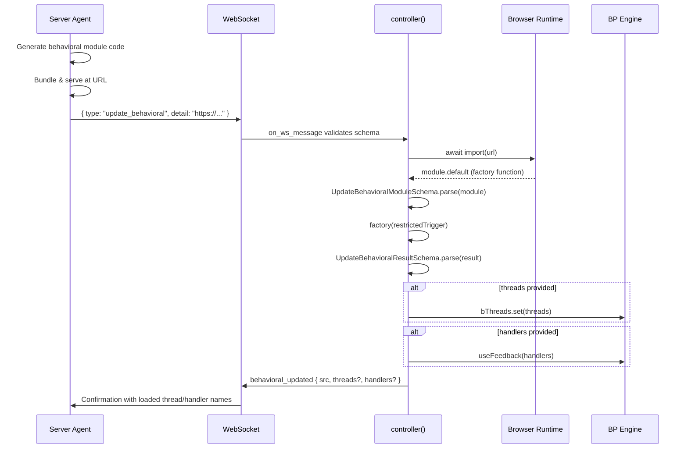

# Dynamic Behavioral Code Loading (update_behavioral)

## Overview

The `update_behavioral` protocol message enables **generative UI** — the server agent can command the client browser to dynamically load and execute behavioral programming modules at runtime. This is how an agent goes beyond generating HTML to also generating the client-side logic that powers interactive behavior.

## Flow



## Module Contract

Every dynamically loaded module must conform to `UpdateBehavioralModuleSchema`:

```typescript
// Module must have a default export that is a factory function
export default function factory(trigger: Trigger): UpdateBehavioralResult {
  return {
    // Optional: b-threads to add to the BP engine
    threads: {
      threadName: bThread([
        bSync({ waitFor: 'someEvent' }),
        bSync({ request: { type: 'response' } }),
      ], true),
    },
    // Optional: event handlers (side effects)
    handlers: {
      response(detail) {
        // React to events selected by the engine
      },
    },
  }
}
```

### Validation Schemas

**Module structure** (`UpdateBehavioralModuleSchema`):
```typescript
z.object({
  default: z.custom<(trigger: Trigger) => UpdateBehavioralResult>(
    (val) => trueTypeOf(val) === 'function'
  ),
})
```

**Factory return value** (`UpdateBehavioralResultSchema`):
```typescript
z.object({
  threads: z.record(z.string(), z.custom<RulesFunction>(isRulesFunction)).optional(),
  handlers: z.custom<DefaultHandlers>(/* validates all values are functions */).optional(),
})
```

**Message URL** (`UpdateBehavioralMessageSchema`):
```typescript
z.object({
  type: z.literal('update_behavioral'),
  detail: z.httpUrl(),  // Must be valid HTTP(S) URL
})
```

## Security: restrictedTrigger

The factory function receives `restrictedTrigger` — a sandboxed version of the BP engine's `trigger` that only allows specific event types:

```typescript
// What restrictedTrigger allows (from RESTRICTED_EVENTS):
const allowed = {
  // Client → Server feedback
  behavioral_updated: true,
  root_connected: true,
  user_action: true,
  snapshot: true,
  // WebSocket lifecycle
  connect: true,
  retry: true,
  on_ws_error: true,
  on_ws_message: true,
  on_ws_open: true,
}

// Element callbacks are also allowed:
// on_adopted, on_attribute_changed, on_connected, on_disconnected,
// on_form_associated, on_form_disabled, on_form_reset, on_form_state_restore
```

**Blocked events** (only the controller itself can trigger these):
- `render` — prevents loaded code from injecting HTML
- `attrs` — prevents loaded code from changing attributes
- `disconnect` — prevents loaded code from tearing down the shell

This creates a **trust boundary**: dynamically loaded code participates in the BP engine's event coordination but cannot directly manipulate the DOM or the WebSocket connection.

## Confirmation Message

After successful loading, the controller sends back:

```typescript
{
  type: 'behavioral_updated',
  detail: {
    src: 'https://cdn.example.com/modules/form-handler.js',
    threads: ['form-submit', 'form-validate'],  // Thread names registered
    handlers: ['onValid', 'onInvalid'],          // Handler names registered
  },
}
```

The server agent can use this confirmation to:
- Verify the module loaded correctly
- Track which behavioral modules are active on the client
- Sequence follow-up actions (e.g., send initial data after behavior is ready)

## Agent Workflow for Generating Modules

An agent building generative UI follows this pattern:

1. **Generate behavioral code** — based on the UI being rendered, write TypeScript/JavaScript that defines threads and handlers
2. **Bundle the module** — compile to a single JavaScript file suitable for `import()`
3. **Serve at a URL** — make the bundled module accessible via HTTPS
4. **Send `update_behavioral`** — tell the client to load it
5. **Wait for `behavioral_updated`** — confirm the module loaded
6. **Continue rendering** — send additional `render` messages knowing the client now has interactive behavior

### Pattern: Render Then Animate

```typescript
// 1. Send the HTML
ws.send(JSON.stringify({
  type: 'render',
  detail: {
    target: 'form-container',
    html: render(<ContactForm />),
    swap: 'innerHTML',
  },
}))

// 2. Send the behavior
ws.send(JSON.stringify({
  type: 'update_behavioral',
  detail: 'https://cdn.example.com/modules/contact-form.js',
}))

// 3. Server waits for behavioral_updated before accepting form submissions
```

### Pattern: Progressive Enhancement

```typescript
// Initial render: static content
ws.send(JSON.stringify({
  type: 'render',
  detail: { target: 'root', html: render(staticDashboard), swap: 'innerHTML' },
}))

// Later: add interactivity as needed
ws.send(JSON.stringify({
  type: 'update_behavioral',
  detail: 'https://cdn.example.com/modules/chart-interaction.js',
}))

// Even later: add more features
ws.send(JSON.stringify({
  type: 'update_behavioral',
  detail: 'https://cdn.example.com/modules/data-filter.js',
}))
```

## Error Handling

If `import()` fails (network error, invalid module), the controller throws within the BP engine's event cycle. The error surfaces as:
- A `snapshot` message with error details (if `useSnapshot` is configured)
- The WebSocket remains open for retry

If schema validation fails (module doesn't have default export, factory returns wrong shape), a Zod error is thrown. The server can detect this via missing `behavioral_updated` response.
