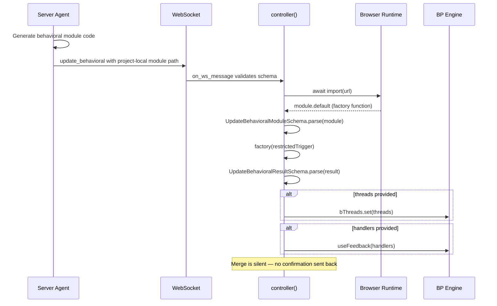

# Dynamic Behavioral Code Loading (update_behavioral)

## Overview

The `update_behavioral` protocol message enables **generative UI** — the server agent can command the client browser to dynamically load and execute behavioral programming modules at runtime. This is how an agent goes beyond generating HTML to also generating the client-side logic that powers interactive behavior.

**This is the only path for dynamic code loading.** Inline `<script>` tags in `render` messages are inert — the HTML spec marks scripts inserted via fragment parsing APIs (`setHTMLUnsafe`, `innerHTML`) as "parser-inserted" and suppresses execution. Scripts only execute during initial page parse or via `document.createElement('script')` + append. The `update_behavioral` protocol uses `import(url)`, which correctly fetches and evaluates ES modules at runtime.

## Flow


```mermaid
sequenceDiagram
    participant Agent as Server Agent
    participant WS as WebSocket
    participant Controller as controller()
    participant Browser as Browser Runtime
    participant BP as BP Engine

    Agent->>Agent: Generate behavioral module code
    Agent->>WS: update_behavioral with project-local module path

    WS->>Controller: on_ws_message validates schema
    Controller->>Browser: await import(url)
    Browser-->>Controller: module.default (factory function)

    Controller->>Controller: UpdateBehavioralModuleSchema.parse(module)
    Controller->>Controller: factory(restrictedTrigger)
    Controller->>Controller: UpdateBehavioralResultSchema.parse(result)

    alt threads provided
        Controller->>BP: bThreads.set(threads)
    end
    alt handlers provided
        Controller->>BP: useFeedback(handlers)
    end

    Note over Controller: Merge is silent — no confirmation sent back
```

## Module Contract

Every dynamically loaded module must conform to `UpdateBehavioralModuleSchema`:

```typescript
// Module must have a default export that is a factory function
export default function factory(trigger: Trigger): UpdateBehavioralResult {
  return {
    // Optional: b-threads to add to the BP engine
    threads: {
      threadName: bThread([
        bSync({ waitFor: 'someEvent' }),
        bSync({ request: { type: 'response' } }),
      ], true),
    },
    // Optional: event handlers (side effects)
    handlers: {
      response(detail) {
        // React to events selected by the engine
      },
    },
  }
}
```

### Validation Schemas

**Module structure** (`UpdateBehavioralModuleSchema`):
```typescript
z.object({
  default: z.custom<(trigger: Trigger) => UpdateBehavioralResult>(
    (val) => trueTypeOf(val) === 'function'
  ),
})
```

**Factory return value** (`UpdateBehavioralResultSchema`):
```typescript
z.object({
  threads: z.record(z.string(), z.custom<ReturnType<BSync>>(isBehavioralRule)).optional(),
  handlers: z.custom<DefaultHandlers>(/* validates all values are functions */).optional(),
})
```

**Message URL** (`UpdateBehavioralMessageSchema`):
```typescript
z.object({
  type: z.literal('update_behavioral'),
  detail: z.httpUrl(),  // Must be valid HTTP(S) URL
})
```

## Security: restrictedTrigger

The factory function receives `restrictedTrigger` — a sandboxed version of the BP engine's `trigger`. `useRestrictedTrigger` takes the list of events to **block** — everything else passes through:

```typescript
// What restrictedTrigger BLOCKS (from RESTRICTED_EVENTS + ELEMENT_CALLBACKS):
const blocked = {
  // Client → Server messages
  client_connected: true,
  user_action: true,
  snapshot: true,
  // WebSocket lifecycle
  connect: true,
  retry: true,
  on_ws_error: true,
  on_ws_message: true,
  on_ws_open: true,
  // Element callbacks (added by controlIsland)
  on_adopted: true,
  on_attribute_changed: true,
  on_connected: true,
  on_disconnected: true,
  on_form_associated: true,
  on_form_disabled: true,
  on_form_reset: true,
  on_form_state_restore: true,
}

// What PASSES THROUGH (allowed):
// render, attrs, update_behavioral, disconnect, any custom event types
```

This creates a **trust boundary**: dynamically loaded code participates in the BP engine's event coordination (can request renders, attribute updates via normal event flow) but cannot fire client→server messages, WebSocket lifecycle events, or element callbacks directly.

## No Confirmation Message

The controller does **not** send a confirmation after loading a behavioral module. The merge of threads and handlers into the BP engine is silent. The server observes success through:
- Subsequent client behavior (e.g., the loaded module's threads start requesting events)
- Snapshot messages — `useSnapshot` captures all BP engine decisions and the controller sends them to the server
- Absence of error — if `import()` or schema validation fails, the error surfaces in snapshot messages

## Agent Workflow for Generating Modules

An agent building generative UI follows this pattern:

1. **Generate behavioral code** — based on the UI being rendered, write TypeScript/JavaScript that defines threads and handlers
2. **Serve at a URL** — make the module accessible via HTTPS (`import()` supports both single files and code-split modules with their own imports — the delivery pattern is TBD)
3. **Send `update_behavioral`** — tell the client to load it
4. **Continue rendering** — send additional `render` messages; the client's BP engine coordinates event flow once the module is loaded
5. **Observe via snapshots** — monitor snapshot messages for confirmation that new threads are active

<!-- TODO: Agent workflow patterns (render-then-animate, progressive enhancement)
     depend on server layer design — module delivery, message routing, and how the
     agent produces protocol messages. Define these after src/server/ is built. -->

## Error Handling

If `import()` fails (network error, invalid module), the controller throws within the BP engine's event cycle. The error surfaces as:
- A `snapshot` message with error details — `useSnapshot` captures all BP engine decisions
- The WebSocket remains open for retry

If schema validation fails (module doesn't have default export, factory returns wrong shape), a Zod error is thrown. The error surfaces in snapshot messages sent to the server.
