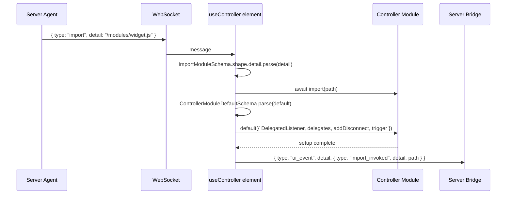

# Controller Modules

## Overview

Controller modules are Plaited UI's browser-side code-loading boundary.

Use them when pushed HTML and attributes are not enough and the browser needs a
small side-effect setup step, such as attaching a delegated listener to a
third-party widget or bridging a browser-only API.

The server sends an `import` controller message. The browser validates that the
path is a site-root JavaScript path, dynamically imports it, validates the
module default export, invokes it with `ControllerModuleContext`, and then emits
`import_invoked` as a BP event inside `ui_event`.

Rendered `<script>` tags are inert and are not the code-loading mechanism.

## Flow



## Import Path Contract

Allowed paths:

- start with exactly one `/`
- end in `.js`
- may include query strings
- may include hash fragments
- are resolved relative to the current site origin by browser `import()`

Examples:

- `/modules/palette.js`
- `/modules/palette.js?v=7`
- `/modules/palette.js#entry`
- `/modules/palette.js?v=7#entry`

Rejected paths:

- `modules/palette.js`
- `//cdn.example.com/palette.js`
- `https://cdn.example.com/palette.js`
- `/modules/palette.ts`
- `/modules/palette.js.map`
- `/modules/palette.js extra`

## Module Contract

The module default export must be callable. It may be synchronous or async.

```ts
import type { ControllerModuleContext } from 'plaited/ui'

export default async ({ DelegatedListener, delegates, addDisconnect, trigger }: ControllerModuleContext) => {
  const element = document.querySelector('[data-enhance="picker"]')
  if (!element) return

  const listener = new DelegatedListener(() => {
    trigger({
      type: 'picker_opened',
      detail: {
        id: element.id,
      },
    })
  })

  delegates.set(element, listener)
  element.addEventListener('click', listener)
  addDisconnect(() => element.removeEventListener('click', listener))
}
```

## Context Fields

| Field | Use |
|---|---|
| `DelegatedListener` | Create native `EventListener` objects around sync or async callbacks. |
| `delegates` | Store listener references by target so cleanup and duplicate prevention stay explicit. |
| `addDisconnect` | Register cleanup callbacks that run when the island disconnects or leaves the DOM. |
| `trigger` | Send BP-shaped events back to the server as `ui_event` messages. |

## Design Rules

- Keep modules local to the current origin.
- Keep modules side-effect oriented; do not turn them into a second app runtime.
- Prefer server-pushed `render` and `attrs` for UI changes.
- Use modules only for browser-only setup or event integration.
- Always register cleanup for listeners, observers, timers, or external handles.
- Emit BP-shaped events with `trigger`.
- Do not open separate WebSocket connections from controller modules.
- Do not depend on module exports other than the default setup function.

## Error Behavior

The controller reports errors through top-level `error` messages when:

- JSON or BP event parsing fails
- import path validation fails
- browser `import(path)` rejects
- the module default export is missing or not callable
- the default setup function throws or rejects
- the server sends an unsupported controller event type

Tests for these paths belong in:

- `src/ui/controller/tests/controller.schemas.spec.ts`
- `src/ui/controller/tests/controller-browser.spec.ts`
