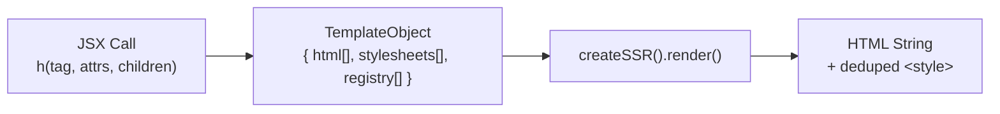

# Server-Side Rendering Pipeline

## Overview

The server pipeline converts JSX templates into HTML strings with per-connection
style deduplication. An agent uses this pipeline to generate UI that streams to
the browser over WebSocket.

## Pipeline Stages

### Stage 1: Template Creation

JSX calls produce template objects, not DOM nodes.

Key behaviors:

- text children are HTML-escaped by default
- `trusted={true}` on `<script>` bypasses escaping
- `on*` handlers throw; use `p-trigger`
- boolean attributes emit presence/absence
- void elements do not render closing tags

### Stage 2: Style Collection

Styled elements contribute CSS to `stylesheets[]`:

- `createStyles` contributes atomic class rules
- `createHostStyles` contributes `:host{}` rules
- `createTokens` contributes `:root{--token:...}` declarations

### Stage 3: Rendering with Deduplication

`createSSR()` tracks styles sent on a connection and only injects fresh ones.

It also rewrites:

- `:host{}` -> `:root{}`
- `:host(<selector>)` -> `:root<selector>`

for SSR/light-DOM output.

### Stage 4: Style Injection Position

`createSSR().render()` prefers:

1. before `</head>`
2. after `<body>`
3. start of the fragment as fallback

## Per-Connection Lifecycle

Use one `createSSR()` instance per live connection. That preserves stylesheet
deduplication across renders for the same browser session.

Reset style state when the connection or session is torn down.

## Composition Patterns

- fragments for wrapper-free composition
- `p-target` for later server-addressable updates
- `decorateElements` for structural custom elements / shadow DOM
- `controlIsland` for interactive islands with their own BP/controller surface

## Security Model

| Protection | Mechanism |
|---|---|
| XSS in text content | automatic HTML escaping |
| event handler injection | block `on*`; use `p-trigger` |
| dynamic script execution | `render`-inserted scripts are inert |
| attribute safety | only primitive attribute values |

`trusted` only affects SSR template escaping. It does not make scripts delivered
through `render` execute.
