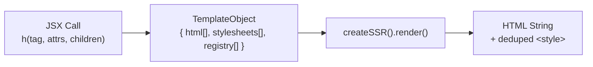

# Server-Side Rendering Pipeline

## Overview

The server pipeline converts JSX templates into HTML strings with per-connection
style deduplication. An agent uses this pipeline to generate UI that streams to
the browser as initial HTML or as pushed controller `render` messages.

## Pipeline Stages

### Stage 1: Template Creation

JSX calls produce template objects, not DOM nodes.

Key behaviors:

- text children are HTML-escaped by default
- `trusted={true}` on `<script>` bypasses escaping at SSR time
- `on*` handlers throw; use `p-trigger`
- `p-target` marks descendants that controller islands can update
- `p-trigger` serializes DOM event bindings for controller islands
- `p-topic` selects the WebSocket topic for controller island hosts
- boolean attributes emit presence/absence
- void elements do not render closing tags

### Stage 2: Style Collection

Styled elements contribute CSS to `stylesheets[]`:

- `createStyles` contributes atomic class rules
- `createHostStyles` contributes `:host{}` rules
- `createTokens` contributes `:root{--token:...}` declarations

### Stage 3: Rendering with Deduplication

`createSSR()` tracks styles sent on a connection and only injects fresh ones.

It also rewrites:

- `:host{}` -> `:root{}`
- `:host(<selector>)` -> `:root<selector>`

for SSR/light-DOM output.

### Stage 4: Style Injection Position

`createSSR().render()` prefers:

1. before `</head>`
2. after `<body>`
3. start of the fragment as fallback

## Per-Connection Lifecycle

Use one `createSSR()` instance per live connection. That preserves stylesheet
deduplication across renders for the same browser session.

Reset style state when the connection or session is torn down.

## Composition Patterns

- fragments for wrapper-free composition
- `p-target` for later server-addressable updates
- `decorateElements` for structural custom elements / shadow DOM
- `controlIsland` for topic-scoped runtime ownership
- controller modules for browser-side side effects that cannot be represented as
  pushed HTML or attributes

## Controller Island Handoff

`controlIsland(tag)` returns a branded template function and, in the browser,
registers the matching custom element. Use the returned template in SSR when you
want the host element to carry the correct `display: contents` style collection.

At runtime, the island:

- connects to `/ws` with `p-topic` as the WebSocket subprotocol
- applies `render` and `attrs` messages only inside the island
- binds `p-trigger` elements inserted through `render`
- loads side-effect controller modules through `import` messages
- sends `ui_event` and `error` messages back to the server

## Security Model

| Protection | Mechanism |
|---|---|
| XSS in text content | automatic HTML escaping |
| event handler injection | block `on*`; use `p-trigger` |
| dynamic script execution | `render`-inserted scripts are inert |
| attribute safety | only primitive attribute values |
| controller module loading | site-root `.js` import paths only |

`trusted` only affects SSR template escaping. It does not make scripts delivered
through `render` execute. Use controller module imports for browser-side setup.
