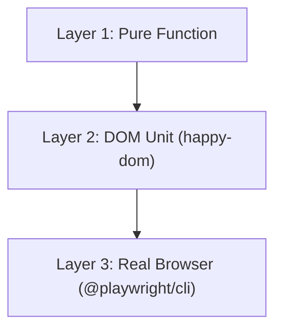

# UI Testing Strategy

## Three Layers



## Layer 1: Pure Function

Use for:

- controller schema validation
- constants and event names
- pure transforms
- CSS helpers

Runner:

- `bun test`

Current controller schema command:

```bash
bun test src/controller/tests/controller.schemas.spec.ts
```

## Layer 2: DOM Unit

Use for:

- `DelegatedListener`
- decorator template shape
- template output structure
- stable Shadow DOM serialization

Runner:

- `bun test`

Rules:

- do not append control islands to the DOM in happy-dom
- keep these tests focused on pure DOM/template behavior, not live transport

Current focused commands:

```bash
bun test src/controller/tests/delegated-listener.spec.ts
bun test src/controller/tests/decorate-elements.spec.tsx
```

## Layer 3: Real Browser

Use for:

- WebSocket render roundtrips
- swap modes
- declarative shadow DOM
- attribute mutations
- `p-trigger` to `ui_event` flows
- dynamic `import()` and controller module callbacks
- imported delegated listeners
- import and unsupported-message errors
- disconnect cleanup callbacks
- reconnect/retry behavior

Runner:

- `bun test src/controller/tests/controller-browser.spec.ts`

Use a real fixture server rather than a mocked WebSocket stack.
The fixture server is `src/controller/tests/fixtures/serve.ts`.

## Controller Browser Fixtures

Source fixtures live in `src/controller/tests/fixtures/`.

Use:

- `serve.ts` for static and dynamic browser fixture pages
- `bundle-controller.ts` for bundling the browser controller runtime
- `controller-module.ts` for valid side-effect module behavior
- `invalid-controller-module.ts` for import validation failures

The fixture server builds these files into an ignored `dist` directory. Do not
commit generated fixture output.

## Coverage Checklist

Browser tests should cover:

- custom element registration
- default `innerHTML` behavior when `render.detail.swap` is omitted
- all six swap modes
- `attrs` set, remove, boolean, and number values
- `p-trigger` event serialization with triggering element attributes
- dynamic import of a valid controller module
- `import_invoked` after module setup
- imported module delegated listeners
- `addDisconnect` cleanup
- invalid imported module default export
- unsupported server-originated event type reporting
- retry after supported WebSocket close codes

## Anti-Patterns

Avoid:

- cross-file `mock.module` setups for UI transport behavior
- fake WebSocket layers for protocol-heavy tests
- hardcoded ports in browser fixtures
- skipping wait time for async WebSocket/UI propagation
