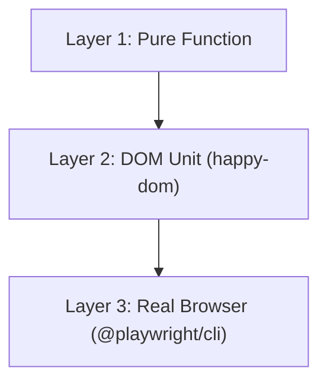

# UI Testing Strategy

## Three Layers

## Layer 1: Pure Function

Use for:

- schema validation
- constants and enums
- pure transforms
- CSS helpers

Runner:

- `bun test`

## Layer 2: DOM Unit

Use for:

- custom element registration
- module return shape
- template output structure

Runner:

- `bun test` with `@happy-dom/global-registrator`

Rules:

- do not append control islands to the DOM in happy-dom
- keep these tests focused on registration/module shape, not live transport

## Layer 3: Real Browser

Use for:

- WebSocket render roundtrips
- swap modes
- declarative shadow DOM
- attribute mutations
- `p-trigger` action flows
- dynamic `import()` and behavioral loading
- reconnect/retry behavior

Runner:

- `@playwright/cli`

Use a real fixture server rather than a mocked WebSocket stack.

## Anti-Patterns

Avoid:

- cross-file `mock.module` setups for UI transport behavior
- fake WebSocket layers for protocol-heavy tests
- hardcoded ports in browser fixtures
- skipping wait time for async WebSocket/UI propagation
