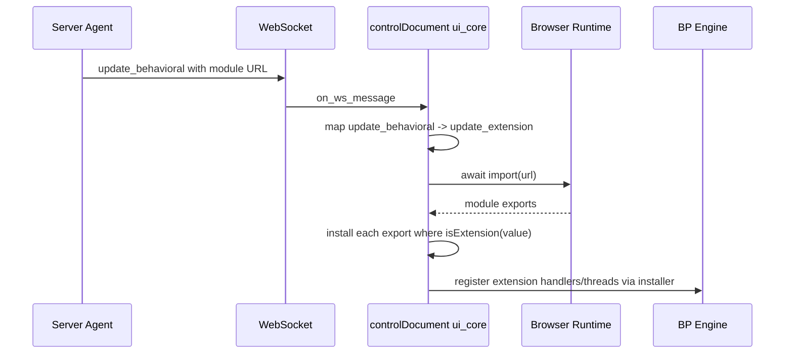

# Dynamic Behavioral Code Loading

## Overview

`update_behavioral` is the wire-compatible server message used to request runtime
UI extension loading after initial page load.

Scripts inserted through fragment parsing APIs like `innerHTML` or
`setHTMLUnsafe` are inert. Runtime client logic must be loaded through
`import(url)`.

## Flow

## Module Contract

Required contract:

- module exports one or more `useExtension(...)` values
- installer accepts only branded extension callables (`isExtension(value)`)
- default export is not special-cased

Not supported in this UI lane:

- legacy raw `(trigger) => result` factories
- `useUIModule(...)` wrapper contracts
- action metadata side channels for direct local handler dispatch

## Security Notes

Inbound server-originated WebSocket messages are allowlisted to wire events:

- `render`
- `attrs`
- `disconnect`
- `update_behavioral` (internally mapped to `update_extension`)

Unsupported inbound event types are dropped and reported through snapshot
`extension_error` diagnostics. Server messages cannot directly trigger
extension-local handler event types.

## Operational Notes

- extension install success is observed through behavior or snapshots
- import/validation failures surface through feedback/snapshot error paths
- local UI extensions that react to DOM actions should listen to scoped
  `ui_core:user_action` events and request their own local events
