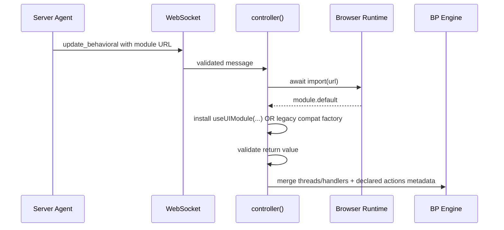

# Dynamic Behavioral Code Loading

## Overview

`update_behavioral` is the supported path for loading new client behavior after
initial page load.

It exists because scripts inserted through fragment parsing APIs like
`innerHTML` or `setHTMLUnsafe` are inert. Dynamic client logic must be loaded
through `import(url)`.

## Flow

## Module Contract

Preferred contract:

- default export from `useUIModule(name, callback)`
- callback receives listener-first helpers (`local`, `external`, `action`,
  wrapped `bSync`, wrapped `bThread`, wrapped `emit`, wrapped `addThreads`)
- callback returns optional `threads` and optional local-only `handlers`
- `action(schema)` declarations become explicit local p-trigger routing metadata

Legacy compatibility (temporary):

- raw `(trigger) => { threads?, handlers?, actions? }` module factories still load
- local p-trigger routing only uses explicit `actions` metadata in this path

Both contracts are validated before merging into the client BP engine.

Result fields:

- optional `threads`
- optional `handlers`
- optional `actions` (explicit p-trigger local routing interest)

## Operational Notes

- merge is silent; there is no explicit success acknowledgement
- observe success through subsequent behavior or snapshots
- import or schema failures surface through the controller/BP error path
- legacy compatibility installs emit `module_warning` snapshots to make migration
  explicit
