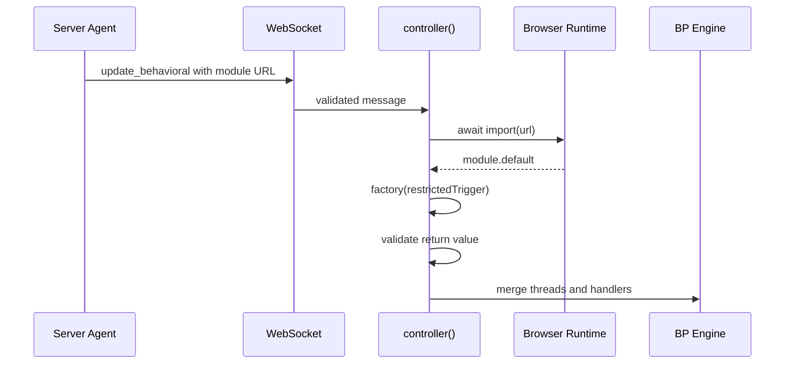

# Dynamic Behavioral Code Loading

## Overview

`update_behavioral` is the supported path for loading new client behavior after
initial page load.

It exists because scripts inserted through fragment parsing APIs like
`innerHTML` or `setHTMLUnsafe` are inert. Dynamic client logic must be loaded
through `import(url)`.

## Flow

## Module Contract

The module must default-export a factory that receives `restrictedTrigger` and
returns:

- optional `threads`
- optional `handlers`

Both are validated before merging into the client BP engine.

## Security Model

The factory receives `restrictedTrigger`, not the full trigger surface.

Blocked event classes include:

- client -> server transport events
- WebSocket lifecycle events
- element lifecycle callbacks

Allowed events include normal UI coordination such as:

- `render`
- `attrs`
- `disconnect`
- custom local events

This creates a meaningful trust boundary around dynamically loaded code.

## Operational Notes

- merge is silent; there is no explicit success acknowledgement
- observe success through subsequent behavior or snapshots
- import or schema failures surface through the controller/BP error path
