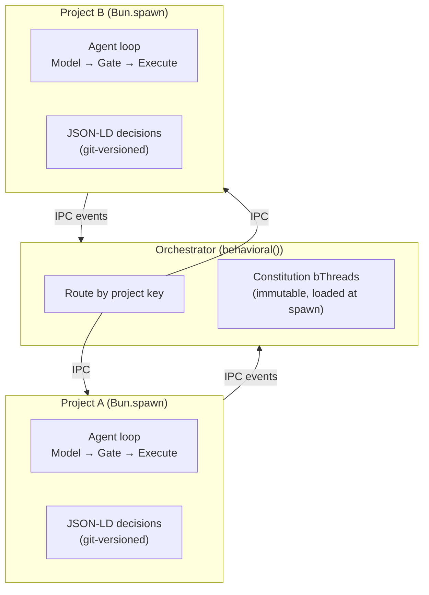

# Project Isolation

## Purpose

This skill teaches agents how to implement hard process boundaries between projects using Bun.spawn IPC. A single agent may work across multiple git repositories with different security contexts — project isolation ensures memory separation, crash containment, and independent tool/constitution configuration per project.

Treat this as the current architectural guidance for project isolation, not a claim
that every routing and spawn policy described here is fully settled or already the
final long-term design.

**Use this when:**
- Implementing the orchestrator → project subprocess architecture
- Wiring IPC trigger bridges between processes
- Assembling tool layers at subprocess spawn
- Loading constitutions as immutable bThreads
- Spawning sub-agents within a project subprocess
- Designing cross-project knowledge transfer

**Use with caution when:**
- deciding whether a concern belongs in the stable architecture or an experimental research lane
- treating a sketched policy as if it were already the only approved runtime behavior

## Architecture

The orchestrator runs a `behavioral()` engine that routes tasks by project key (git root path). Each project gets its own `Bun.spawn()` subprocess with independent agent loop, tools, and constitution.



**Project routing:** A task arrives with a path. The orchestrator resolves the git root, looks up the project in the registry, spawns (or reuses) a subprocess, and forwards the task via IPC.

This is the preferred isolation model today. Specific reuse, lifecycle, and routing
heuristics may still evolve as the multi-repo agent surface matures.

## IPC Trigger Bridge

BP events `{ type, detail }` are natively compatible with `structuredClone` serialization, making Bun's IPC a natural fit.

```typescript
// Orchestrator → Project subprocess
const project = Bun.spawn(['bun', 'run', projectEntry], {
  ipc(message) {
    const event = BPEventSchema.safeParse(message)
    if (event.success) trigger(event.data)
  }
})

// Send task to project
project.send({ type: 'task', detail: { prompt, context } })

// Project subprocess side
process.on('message', (message) => {
  const event = BPEventSchema.safeParse(message)
  if (event.success) trigger(event.data)
})

// Results back to orchestrator
useFeedback({
  tool_result({ detail }) {
    process.send!({ type: 'tool_result', detail })
  }
})
```

See **[references/ipc-bridge.md](references/ipc-bridge.md)** for detailed patterns and serialization constraints.

## Tool Layer Assembly

Tools are assembled from three layers at subprocess spawn time:

```
Framework built-ins (read_file, write_file, bash, save_plan, etc.)
  + ~/.agents/skills/*          → global skills
  + ~/.agents/mcp.json servers  → global MCP tools
  + skills/*                    → project skills
  + OS PATH binaries            → discovered, approval-gated
  + project-local binaries      → node_modules/.bin/, etc.
  → model sees available tools in context
```

See **[references/tool-assembly.md](references/tool-assembly.md)** for the three-layer model and approval rules.

The layering model is stable in principle. The exact default tool set and approval
policies remain implementation choices that may change as the agent becomes more autonomous.

## Constitution Loading

The constitution is loaded at subprocess spawn time and is **immutable for the lifetime of that process.** The orchestrator passes constitution bThreads as part of the spawn configuration. The subprocess cannot modify its own constitution — this is the MAC layer in action.

Constitution rules are additive blocking threads (see **behavioral-core** skill, Pattern 3). Each rule composes independently:

```typescript
// Constitution loaded at spawn — subprocess cannot modify
for (const rule of constitution.rules) {
  bThreads.set({
    [rule.name]: bThread([
      bSync({ block: rule.predicate }),
    ], true),  // persistent: blocks forever
  })
}
```

## Two Levels of Bun.spawn

The architecture uses `Bun.spawn()` at two distinct levels. They serve different purposes but use the same IPC mechanism:

| Level | Purpose | Lifecycle | Spawned By |
|---|---|---|---|
| **Project subprocess** | Isolate codebases with different security contexts | Long-lived (reused across tasks) | Orchestrator |
| **Sub-agent process** | Isolate inference + tool execution per sub-task | Ephemeral (per-task, fresh context) | PM engine within a project subprocess |

```
Orchestrator (behavioral())
  └─ Project A (Bun.spawn)     ← long-lived, per-project
       └─ PM Engine (behavioral())
            ├─ Sub-agent 1 (Bun.spawn)  ← ephemeral, per-task
            ├─ Sub-agent 2 (Bun.spawn)  ← ephemeral, per-task
            └─ Judge (Bun.spawn)        ← ephemeral, per-verification
  └─ Project B (Bun.spawn)
       └─ PM Engine (behavioral())
            └─ ...
```

A project subprocess contains the PM's `behavioral()` engine. The PM can spawn
sub-agents within that subprocess's context so they inherit the project's cwd,
tool assembly, and constitution. The orchestrator routes tasks to the right
project; decomposition within the project remains a policy choice rather than a
guaranteed requirement for every implementation.

## Cross-Project Knowledge

Project subprocesses have hard process boundaries — Project A's memory cannot leak to Project B. Knowledge transfer happens through **model weights**, not data sharing:

| What | Mechanism |
|---|---|
| Shared tool configs | `~/.agents/mcp.json` (user installs globally) |
| Shared skills | `~/.agents/skills/` (global), `skills/` (project-level) |
| Style and patterns | Model weights (training flywheel) + code-pattern skills |
| Project-specific knowledge | Per-project JSON-LD files only (never crosses boundary) |

The hard boundary is the important rule. The precise mechanisms for safe higher-level
transfer, summarization, or promotion across projects are still a research area and
should not be inferred from this skill unless they are explicitly implemented elsewhere.

## Related Skills

- **behavioral-core** — BP patterns (constitution as additive blocking threads)
- **constitution** — Governance factory patterns, MAC/DAC rules
- **agent-loop** — 6-step agent pipeline that runs inside each subprocess
- **hypergraph-memory** — JSON-LD event log partitioning per project
