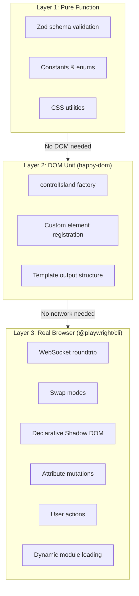
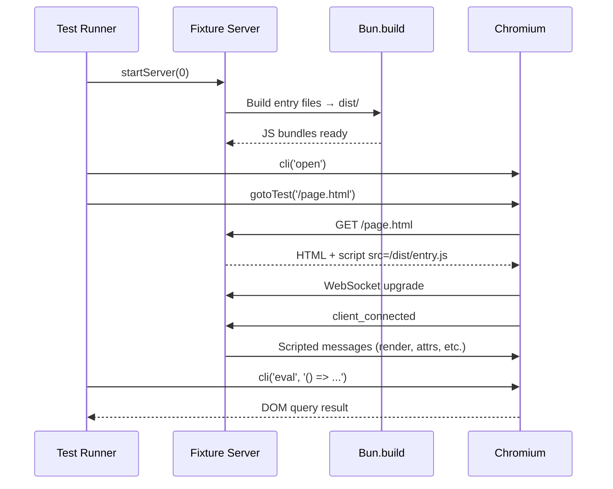

# UI Testing

Three layers matched to complexity. Born from `mock.module` cache poisoning — mocks shared across spec files cause phantom CI failures.

## Layer Strategy



### Decision Table

| What you're testing | Layer | Runner | Why |
|---|---|---|---|
| Schema validation (parse/reject) | 1 - Pure | `bun test` | No DOM, no mocks |
| Constants, enums, pure transforms | 1 - Pure | `bun test` | Pure input → output |
| Factory return shape (.tag, .$, .observedAttributes) | 2 - DOM | `bun test` + happy-dom | Needs `customElements.define()` |
| Custom element registration | 2 - DOM | `bun test` + happy-dom | Needs `customElements.get()` |
| Template output structure | 2 - DOM | `bun test` + happy-dom | Verifies HTML/registry arrays |
| WebSocket render roundtrip | 3 - Browser | `@playwright/cli` | Needs real WebSocket + DOM |
| Swap modes (innerHTML, outerHTML, etc.) | 3 - Browser | `@playwright/cli` | Tests actual DOM mutation |
| Declarative shadow DOM | 3 - Browser | `@playwright/cli` | `setHTMLUnsafe` + `<template shadowrootmode>` |
| Attribute mutations via protocol | 3 - Browser | `@playwright/cli` | Real element attribute API |
| User action roundtrip (p-trigger) | 3 - Browser | `@playwright/cli` | Needs real click + WebSocket |
| Dynamic `import()` + behavioral module | 3 - Browser | `@playwright/cli` | Needs real module loading |
| WebSocket retry/reconnect | 3 - Browser | `@playwright/cli` | Needs real connection lifecycle |

## Layer 1: Pure Function Tests

No DOM, no mocks, no setup. Import the unit, call it, assert the output.

**Living exemplar:** `plaited/src/ui/protocol/tests/controller.schemas.spec.ts`

### Pattern

```typescript
import { describe, expect, test } from 'bun:test'
import { SomeSchema } from '../module.schemas.ts'

describe('SomeSchema', () => {
  test('accepts valid input', () => {
    const input = { type: 'render', detail: { target: 'main', html: '<div/>' } }
    expect(SomeSchema.parse(input)).toEqual(input)
  })

  test('rejects invalid input', () => {
    expect(() => SomeSchema.parse({ type: 'wrong' })).toThrow()
  })
})
```

**Rules:**
- **Test both accept and reject paths** for every schema
- **Use real constants** — `AGENT_TO_CONTROLLER_EVENTS.render`, not `'render'`
  *Verify:* `grep -n "type: '" src/ui/**/tests/*.spec.ts` — string literals for event types indicate stale constants
  *Fix:* Import from `controller.constants.ts` or `events.ts`

## Layer 2: DOM Unit Tests (happy-dom)

Needs `customElements` but not network.

**Living exemplar:** `plaited/src/ui/dom/tests/control-island.spec.ts`

### Pattern

```typescript
import { afterAll, beforeAll, describe, expect, test } from 'bun:test'

beforeAll(async () => {
  const { GlobalRegistrator } = await import('@happy-dom/global-registrator')
  await GlobalRegistrator.register()
})

afterAll(async () => {
  const { GlobalRegistrator } = await import('@happy-dom/global-registrator')
  await GlobalRegistrator.unregister()
})

describe('controlIsland: factory', () => {
  test('returns a ControllerTemplate with .tag', () => {
    const Island = controlIsland({ tag: 'test-tag' })
    expect(Island.tag).toBe('test-tag')
  })
})
```

**Rules:**
- **Never append control islands to DOM** — `connectedCallback` opens a real WebSocket; happy-dom hangs
  *Verify:* `grep -n 'appendChild\|append(' src/ui/**/tests/*island*.spec.ts` — no DOM insertion of control islands
  *Fix:* Test factory return values and registration only
- **`mock.module` within single spec file only** — never across files (cache poisoning)
  *Verify:* `grep -rn 'mock.module' src/ui/` — each file touches only its own mocks
- **Register/unregister happy-dom** in `beforeAll`/`afterAll`
  *Verify:* `grep -n 'GlobalRegistrator' src/ui/**/tests/*.spec.ts` — every DOM test has both

## Fixture Server Pattern

Layer 3 requires a real HTTP + WebSocket server acting as the agent.

**Living exemplar:** `plaited/src/ui/protocol/tests/fixtures/serve.ts`

### Architecture



### Key Decisions

| Decision | Why |
|---|---|
| `Bun.build()` entry files for browser | Module graph resolved at build time, not runtime |
| Dynamic `/test/<tag>` routes | One entry file serves multiple test scenarios via tag-based routing |
| `startServer(0)` for random port | Avoid CI port conflicts |
| WebSocket dispatch on element tag | `root_connected` detail routes to scripted conversation |
| Fixture state via getters | Same-process access for server-side assertions |
| `display: contents` on custom element | Element is invisible wrapper; `p-target` descendant receives renders |

## Layer 3: Real Browser (@playwright/cli)

**Living exemplar:** `plaited/src/ui/protocol/tests/controller-browser.spec.ts`

### Helpers

```typescript
const SESSION = 'ui-test'

const cli = async (...args: string[]) => {
  const proc = Bun.spawn(['bunx', '@playwright/cli', `-s=${SESSION}`, ...args], {
    stdout: 'pipe',
    stderr: 'pipe',
  })
  const text = await new Response(proc.stdout).text()
  await proc.exited
  return text.trim()
}

const parseResult = (output: string) => {
  const match = output.match(/### Result\n([\s\S]*?)(?:\n### |$)/)
  return match?.[1]?.trim() ?? output.trim()
}

const gotoTest = async (path: string, waitMs = 3000) => {
  await cli('goto', `http://localhost:${fixture.port}${path}`)
  await new Promise((r) => setTimeout(r, waitMs))
}
```

### Pattern

```typescript
beforeAll(async () => {
  fixture = startServer(0)
  await cli('open')
  await gotoTest('/first.html')
}, 30000)

afterAll(async () => {
  try { await cli('close') } catch { /* ignore */ }
  await fixture.stop()
}, 30000)

// DOM queries via eval
test('rendered content appears in DOM', async () => {
  const output = await cli('eval', "() => document.getElementById('ws-rendered')?.textContent")
  expect(parseResult(output)).toContain('Hello from WebSocket')
})

// Server-side assertions (same process)
test('server received user_action', () => {
  expect(fixture.lastUserAction).toBeDefined()
})
```

**Rules:**
- **Always `waitMs` in `gotoTest`** — browser needs time for WebSocket messages (default 3000ms, increase for retry tests)
- **30000ms timeout on `beforeAll`/`afterAll`** — browser startup is slow
  *Verify:* `grep -n 'beforeAll\|afterAll' src/ui/**/tests/*browser*.spec.ts` — must have timeout arg

## Anti-Patterns

| Anti-Pattern | Problem | Correct Approach |
|---|---|---|
| MockWebSocket in unit tests | Cache poisoning across spec files; phantom CI failures | Real WebSocket via fixture server (Layer 3) |
| `mock.module` across files | Bun's module cache holds stale mocks; test order matters | Isolate `mock.module` to single spec file, or avoid entirely |
| Appending control islands in happy-dom | `connectedCallback` opens real WebSocket; happy-dom hangs | Only test factory return values and registration (Layer 2) |
| Skipping `waitMs` in `gotoTest` | Browser hasn't received/processed WebSocket messages yet | Always wait (default 3000ms, increase for retry tests) |
| Hardcoded ports | Port conflicts in CI | Use `startServer(0)` for random port assignment |
| Testing swap modes without fixture server | Can't verify actual DOM mutation with mocks | Use Layer 3 with scripted message sequences |

## Related Skills

- **generative-ui** — Controller protocol, server rendering pipeline, dynamic behavioral loading
- **behavioral-core** — BP fundamentals for `update_behavioral` and thread/handler patterns
