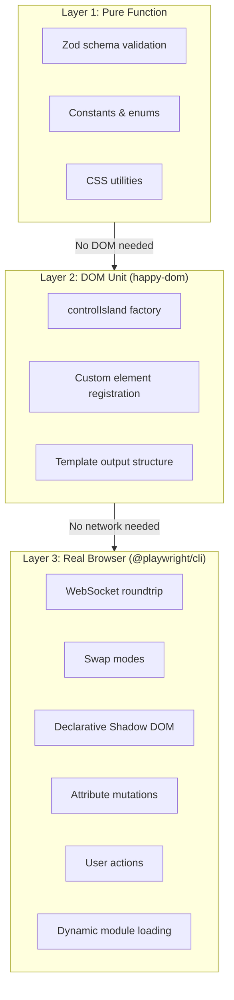
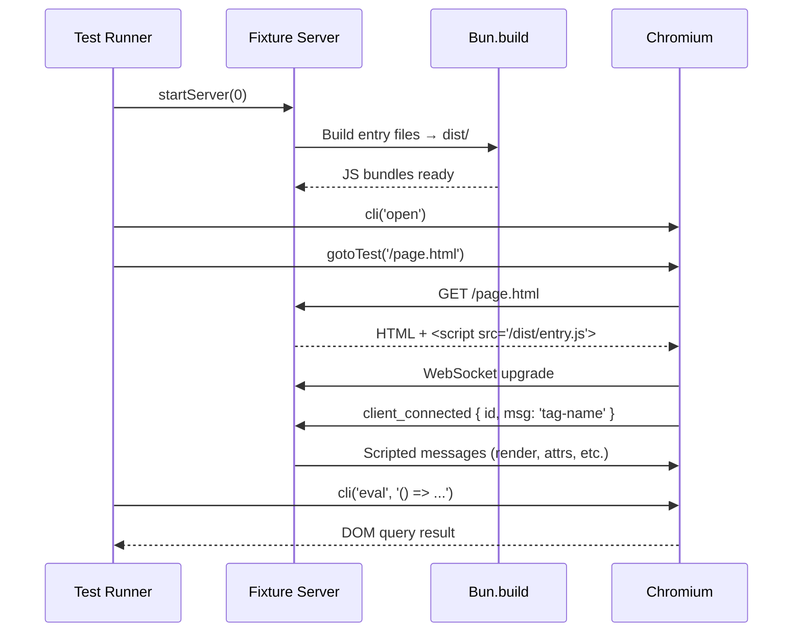

# UI Testing

## Purpose

This skill documents the three-layer test strategy for Plaited's UI layer. It was born from a hard lesson: **mock.module cache poisoning** in bun causes cross-test contamination when multiple spec files mock the same module. Tests that pass in isolation fail together, creating phantom CI failures that waste hours to diagnose.

The solution: push real-browser concerns into real-browser tests, keep DOM unit tests in happy-dom, and let pure functions stay pure. Each layer uses the simplest tool that can prove the behavior.

**Use this when:**
- Writing tests for `controlIsland`, `controlDocument`, or `decorateElements`
- Testing the controller protocol (render, attrs, update_behavioral, user_action)
- Building a fixture server for scripted WebSocket conversations
- Debugging CI failures that look like mock contamination

## Layer Strategy



### Decision Table

| What you're testing | Layer | Runner | Why |
|---|---|---|---|
| Schema validation (parse/reject) | 1 - Pure | `bun test` | No DOM, no mocks |
| Constants, enums, pure transforms | 1 - Pure | `bun test` | Pure input → output |
| Factory return shape (.tag, .$, .observedAttributes) | 2 - DOM | `bun test` + happy-dom | Needs `customElements.define()` |
| Custom element registration | 2 - DOM | `bun test` + happy-dom | Needs `customElements.get()` |
| Template output structure | 2 - DOM | `bun test` + happy-dom | Verifies HTML/registry arrays |
| WebSocket render roundtrip | 3 - Browser | `@playwright/cli` | Needs real WebSocket + DOM |
| Swap modes (innerHTML, outerHTML, etc.) | 3 - Browser | `@playwright/cli` | Tests actual DOM mutation |
| Declarative shadow DOM | 3 - Browser | `@playwright/cli` | `setHTMLUnsafe` + `<template shadowrootmode>` |
| Attribute mutations via protocol | 3 - Browser | `@playwright/cli` | Real element attribute API |
| User action roundtrip (p-trigger) | 3 - Browser | `@playwright/cli` | Needs real click + WebSocket |
| Dynamic `import()` + behavioral module | 3 - Browser | `@playwright/cli` | Needs real module loading |
| WebSocket retry/reconnect | 3 - Browser | `@playwright/cli` | Needs real connection lifecycle |

## Layer 1: Pure Function Tests

No DOM, no mocks, no setup. Import the unit, call it, assert the output.

**Exemplar:** [assets/controller.schemas.spec.ts](assets/controller.schemas.spec.ts)

### Pattern

```typescript
import { describe, expect, test } from 'bun:test'
import { SomeSchema } from '../module.schemas.ts'

describe('SomeSchema', () => {
  test('accepts valid input', () => {
    const input = { type: 'render', detail: { target: 'main', html: '<div/>' } }
    expect(SomeSchema.parse(input)).toEqual(input)
  })

  test('rejects invalid input', () => {
    expect(() => SomeSchema.parse({ type: 'wrong' })).toThrow()
  })
})
```

**Guidelines:**
- Test both accept and reject paths for every schema
- Use real constants from the source (`CONTROLLER_EVENTS.render`, not `'render'`)
- No `beforeAll`/`afterAll` needed

## Layer 2: DOM Unit Tests (happy-dom)

Tests that need `customElements`, `document`, or basic DOM APIs but **not** a real browser or network.

**Exemplar:** [assets/control-island.spec.ts](assets/control-island.spec.ts)

### Pattern

```typescript
import { afterAll, beforeAll, describe, expect, test } from 'bun:test'

beforeAll(async () => {
  const { GlobalRegistrator } = await import('@happy-dom/global-registrator')
  await GlobalRegistrator.register()
})

afterAll(async () => {
  const { GlobalRegistrator } = await import('@happy-dom/global-registrator')
  await GlobalRegistrator.unregister()
})

describe('controlIsland: factory', () => {
  test('returns a ControllerTemplate with .tag', () => {
    const Island = controlIsland({ tag: 'test-tag' })
    expect(Island.tag).toBe('test-tag')
  })
})
```

**Guidelines:**
- **Never append control islands to the DOM** in happy-dom tests. `connectedCallback` calls `controller()`, which opens a real WebSocket — happy-dom cannot handle this. Test the factory return value and registration only.
- `mock.module` is acceptable within a single spec file for isolating DOM-only behavior, but **never mock across files** — this causes cache poisoning.
- Register happy-dom in `beforeAll`, unregister in `afterAll` to avoid leaking globals.

## Fixture Server Pattern

Layer 3 tests require a real HTTP + WebSocket server that acts as the agent — responding to `client_connected` with scripted message sequences.

**Exemplar:** [assets/serve.ts](assets/serve.ts)

### Architecture



### Key Components

**Entry files** — Built with `Bun.build()` for browser consumption. Each entry registers custom elements and imports from the main source:

```typescript
// control-island.entry.ts
import { controlIsland } from '../../control-island.ts'
controlIsland({ tag: 'test-island', observedAttributes: ['value', 'label'] })
```

**Static HTML** — Fixtures provide the initial DOM structure. The control island must have `display: contents` and a descendant with `p-target`:

```html
<test-island>
  <div p-target="main"><p>initial content</p></div>
</test-island>
```

**Dynamic test pages** — `generateTestPage(tag)` creates HTML on demand for `/test/<tag>` routes, reusing a single entry file for multiple test scenarios.

<!-- TODO: WebSocket routing and server state patterns depend on src/server/ design -->

## @playwright/cli Test Pattern

Real browser tests use `@playwright/cli` — a CLI wrapper around Playwright that manages a persistent Chromium session.

**Exemplar:** [assets/controller-browser.spec.ts](assets/controller-browser.spec.ts)

### Helpers

```typescript
const SESSION = 'ui-test'

/** Run a playwright-cli command. */
const cli = async (...args: string[]) => {
  const proc = Bun.spawn(['bunx', '@playwright/cli', `-s=${SESSION}`, ...args], {
    stdout: 'pipe',
    stderr: 'pipe',
  })
  const text = await new Response(proc.stdout).text()
  await proc.exited
  return text.trim()
}

/** Extract result from playwright-cli eval output. */
const parseResult = (output: string) => {
  const match = output.match(/### Result\n([\s\S]*?)(?:\n### |$)/)
  return match?.[1]?.trim() ?? output.trim()
}

/** Navigate and wait for WebSocket render. */
const gotoTest = async (path: string, waitMs = 3000) => {
  await cli('goto', `http://localhost:${fixture.port}${path}`)
  await new Promise((r) => setTimeout(r, waitMs))
}
```

### Test Lifecycle

```typescript
beforeAll(async () => {
  fixture = startServer(0)       // Random port
  await cli('open')               // Launch Chromium session
  await gotoTest('/first.html')   // Navigate + wait for WS
}, 30000)

afterAll(async () => {
  try { await cli('close') } catch { /* ignore */ }
  await fixture.stop()
}, 30000)
```

### DOM Assertions

All DOM queries go through `cli('eval', ...)`:

```typescript
test('rendered content appears in DOM', async () => {
  const output = await cli('eval', "() => document.getElementById('ws-rendered')?.textContent")
  const result = parseResult(output)
  expect(result).toContain('Hello from WebSocket')
})
```

### Server-Side Assertions

Access fixture state directly in tests (same process):

```typescript
test('server received user_action', () => {
  expect(fixture.lastUserAction).toBeDefined()
  expect((fixture.lastUserAction as Record<string, unknown>).detail).toBe('test_click')
})
```

## Anti-Patterns

| Anti-Pattern | Problem | Correct Approach |
|---|---|---|
| MockWebSocket in unit tests | Cache poisoning across spec files; phantom CI failures | Real WebSocket via fixture server (Layer 3) |
| `mock.module` across files | Bun's module cache holds stale mocks; test order matters | Isolate `mock.module` to a single spec file, or avoid entirely |
| Appending control islands in happy-dom | `connectedCallback` opens a real WebSocket; happy-dom hangs | Only test factory return values and registration (Layer 2) |
| Skipping `waitMs` in `gotoTest` | Browser hasn't received/processed WebSocket messages yet | Always wait (default 3000ms, increase for retry tests) |
| Hardcoded ports | Port conflicts in CI | Use `startServer(0)` for random port assignment |
| Testing swap modes without a fixture server | Can't verify actual DOM mutation with mocks | Use Layer 3 with scripted message sequences |

## Related Skills

- **generative-ui** - Controller protocol, server rendering pipeline, dynamic behavioral loading
- **code-patterns** - Pure function testing patterns and TypeScript conventions
- **behavioral-core** - BP fundamentals for understanding `update_behavioral` and thread/handler patterns
