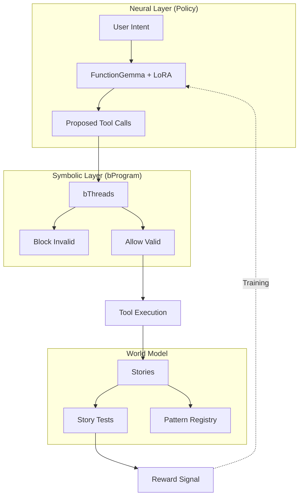
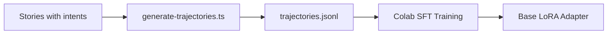
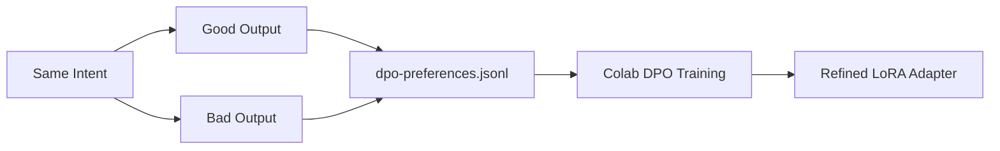
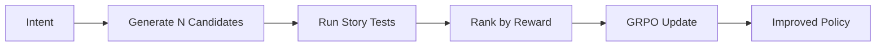
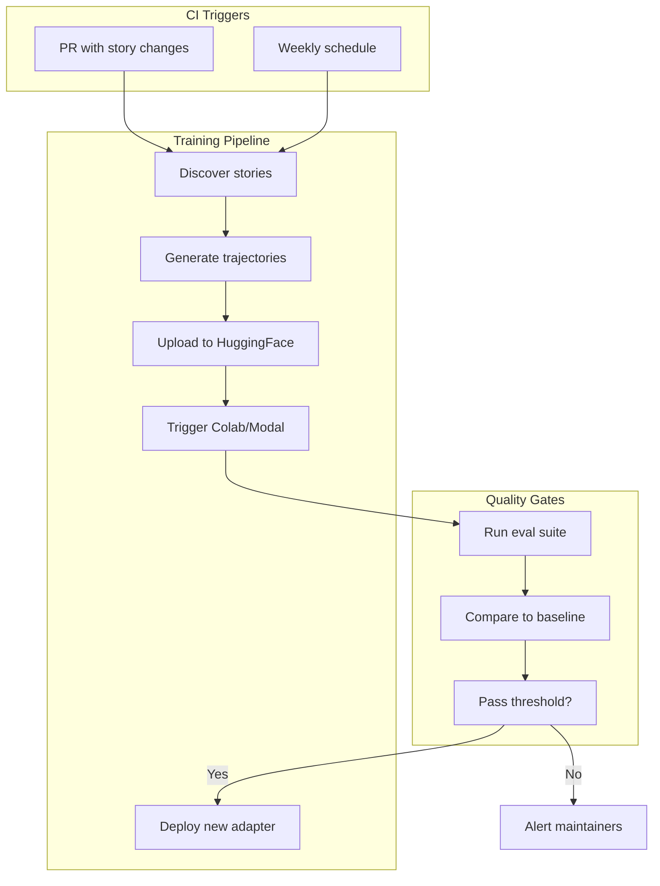

# World Agent Training

Training pipeline for the Plaited World Agent—a neuro-symbolic UI generation system that combines neural policy learning with behavioral programming constraints.

## Architecture



### Why "World Agent"?

| Concept | Implementation | Purpose |
|---------|----------------|---------|
| **World Model** | Stories + story tests | Defines valid UI states and transitions |
| **Policy** | FunctionGemma (270M) + LoRA | Proposes actions (tool calls) given intent |
| **Symbolic Constraints** | bThreads | Block invalid actions before execution |

The neural policy learns *what* to generate, while bThreads enforce *how* to generate it correctly.

## Directory Structure

```
training/
  README.md                            # This file
  plaited-world-agent-training.ipynb   # Colab notebook (SFT + DPO)
  trajectories.jsonl                   # SFT training data
  dpo-preferences.jsonl                # DPO preference pairs
  stories/                             # Source stories with intents
    button.stories.tsx
    button.css.ts
    card.stories.tsx
    ...
```

## Training Phases

### Phase 1: Supervised Fine-Tuning (SFT)

SFT teaches the model the basic task: given an intent, generate valid tool calls.



**Input:** `training/stories/*.stories.tsx` with `intent` field
**Output:** `training/trajectories.jsonl`

```bash
# Generate trajectories from stories
bun scripts/generate-trajectories.ts training/stories --output training/trajectories.jsonl
```

**Trajectory format:**
```json
{
  "messages": [
    {"role": "system", "content": "You are a UI generation agent..."},
    {"role": "user", "content": "Create a primary button"},
    {"role": "assistant", "content": "<function_call>writeTemplate{...}</function_call>"}
  ],
  "reward": 0.85,
  "storyResult": {"passed": true, "a11yPassed": true}
}
```

### Phase 2: Direct Preference Optimization (DPO)

DPO teaches the model *which outputs are better* by comparing good vs bad generations.



**Input:** Preference pairs (chosen vs rejected)
**Output:** `training/dpo-preferences.jsonl`

**Preference pair format:**
```json
{
  "prompt": "Create a toggle switch",
  "chosen": "// Accessible: uses button, aria-pressed, keyboard nav\n...",
  "rejected": "// Inaccessible: uses div, no aria, mouse only\n..."
}
```

**What makes outputs "chosen" (good):**
- Passes accessibility checks
- Uses semantic HTML
- Proper ARIA attributes
- Follows Plaited patterns (createStyles, tokens)
- Handles edge cases (loading, disabled, error)

**What makes outputs "rejected" (bad):**
- Fails accessibility
- Div soup instead of semantic elements
- Missing keyboard navigation
- Inline styles instead of createStyles
- Hardcoded values instead of tokens

### Phase 3: GRPO (Future)

Group Relative Policy Optimization for reinforcement learning from story test feedback.



## CI Integration (Planned)

Continuous training pipeline triggered by story changes.



### CI Workflow Steps

1. **Discover** - Find all `*.stories.tsx` in `training/stories/`
2. **Generate** - Create `trajectories.jsonl` and `dpo-preferences.jsonl`
3. **Upload** - Push training data to HuggingFace dataset
4. **Train** - Trigger training job (Colab via API or Modal)
5. **Evaluate** - Run eval suite against baseline
6. **Deploy** - Push new adapter if quality improves

### Environment Variables

```bash
HF_TOKEN=hf_xxx           # HuggingFace API token (write access)
COLAB_API_KEY=xxx         # Optional: Colab API for automated training
MODAL_TOKEN_ID=xxx        # Optional: Modal.com for serverless training
```

### GitHub Actions (Future)

```yaml
name: Train World Agent
on:
  push:
    paths:
      - 'training/stories/**'
  schedule:
    - cron: '0 0 * * 0'  # Weekly

jobs:
  train:
    runs-on: ubuntu-latest
    steps:
      - uses: actions/checkout@v4
      - uses: oven-sh/setup-bun@v1
      - run: bun install
      - run: bun scripts/generate-trajectories.ts training/stories -o training/trajectories.jsonl
      - run: bun scripts/upload-training-data.ts
      - run: bun scripts/trigger-training.ts
```

## Running Locally

### Prerequisites

- Bun >= 1.2.9
- Google account (for Colab)
- HuggingFace account with write access

### Generate Training Data

```bash
# Generate SFT trajectories
bun scripts/generate-trajectories.ts training/stories --output training/trajectories.jsonl

# Generate DPO preferences (after creating good/bad pairs)
bun scripts/generate-dpo-preferences.ts training/stories --output training/dpo-preferences.jsonl
```

### Run Training on Colab

1. Upload `trajectories.jsonl` and `dpo-preferences.jsonl` to Colab
2. Open `plaited-world-agent-training.ipynb`
3. Run cells 1-6 for SFT
4. Run cell 8 for DPO
5. Run cell 9 to push to HuggingFace

## Evaluation

After training, evaluate the model:

```bash
# Run eval suite
bun scripts/run-eval-suite.ts --model plaited/plaited-world-agent-lora

# Compare to baseline (Claude Code one-shots)
bun scripts/compare-baseline.ts --results eval-results.json

# Generate human-readable report
bun scripts/generate-report.ts --results eval-results.json --output report.md
```

See `.claude/skills/world-agent/references/eval-guide.md` for metrics and interpretation.

## Related Resources

- **world-agent skill** - `.claude/skills/world-agent/SKILL.md`
- **Training workflow** - `.claude/skills/world-agent/references/training-workflow.md`
- **Evaluation guide** - `.claude/skills/world-agent/references/eval-guide.md`
- **Tool API** - `.claude/skills/world-agent/references/tool-api.md`
